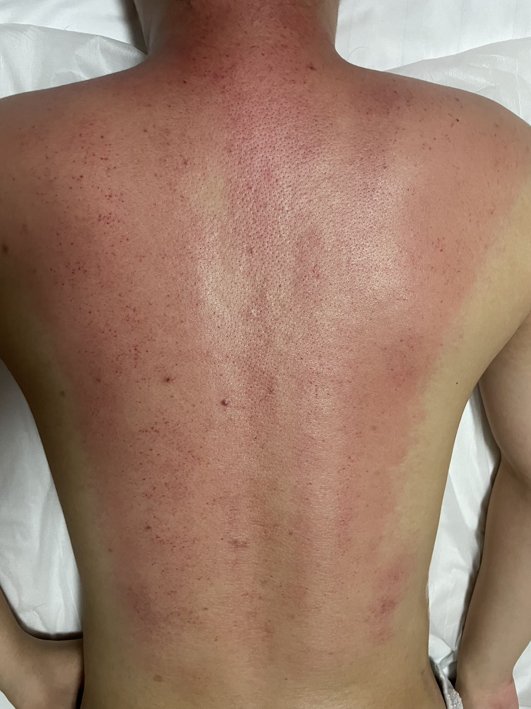
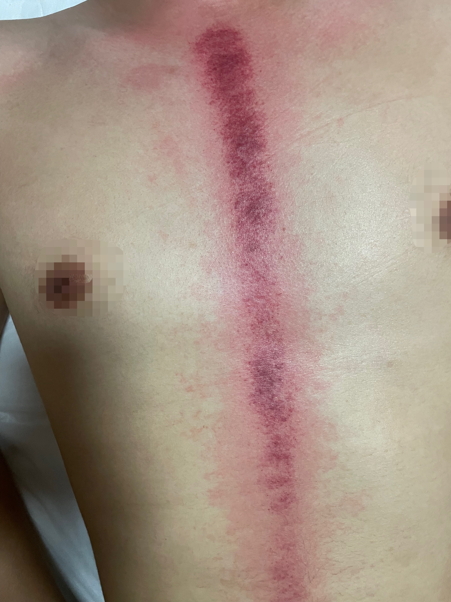

## 230601
首先是半夜两个小时将近20次报错，我快吐了，幸亏最后在hr的帮助下解决了。

我能看到的路:年轻的时候多吃苦，中年就没那么惨了。大水漫灌的年代已经过去了，技术的难以代替性才是我们需要追求的。

压力太大，心情不好，去刮痧了，浅看两张图

送lqy回康庄，第一次骑电动车送姑娘回宿舍楼下，赢麻了，好久没被叫大帅哥，也是很开心的，主要小姑娘我挺喜欢的。

快11点还在操场，好久没被人主动要微信了，还是比较激动的。

## 230602
今天的状态调整还不错，晚上去操场上一起拍了拍照。新认识了个大美女，真的很不错。

昨天加我微信，今天直接被发好人卡，还是有点不舒服的，虽然哥们已经无所谓了

## 230603
很不舒服，zd和gt给我的感觉。这种感觉怎么说呢，亲疏有别和逢场作戏吧。zd的亲疏有别，gt的逢场作戏。麻了，砍掉社交吧，还是。关系太近了，所以他们的一些举动让我更不舒服。恶心到我了，妈的。

##230604
整体还算可以。大晚上陪gt、zd、lx一起喝酒来着，说实话有点糟心，而且拖到有点晚才回去。回应一下昨天提到的问题，就是关系太近，加上我自己对于这方面的事情太敏感，所以搞的自己不舒服。

##230605
编译原理这课有点够，不喜欢N1A的实验室的破凳子坐的我不舒服。
下午zhr带着我过了OS的框架，我的巩固还在继续，晚上把书看了一下，虽然还没看完，每个概念都明白一些，然后连在一起又开始绕了。
接着学英语捏，坚持，加油！

说点学习外的事情，就是突然感觉一个人会更好。独行不会因为别人的一些行为影响到到自己，特别是对于我这种特别敏感的人来说。我对于友情这东西有点太执着了，太变态的想独占了，不太好。

## 230606
今天除了数学的进度，基本上都照顾到了。今天基本上都在独处，感觉还挺不错。不满意的地方还是有挺多地方的（md，其实哪里都不太满意，早上的懈怠，下午实验室一堆破事，晚上的疲惫）

今天又看到violin，换了发型，感觉更有味道了，更喜欢了，虽然已经没啥可能了。

番茄钟和时间块慢慢启用，希望对时间有个更加细致规划。