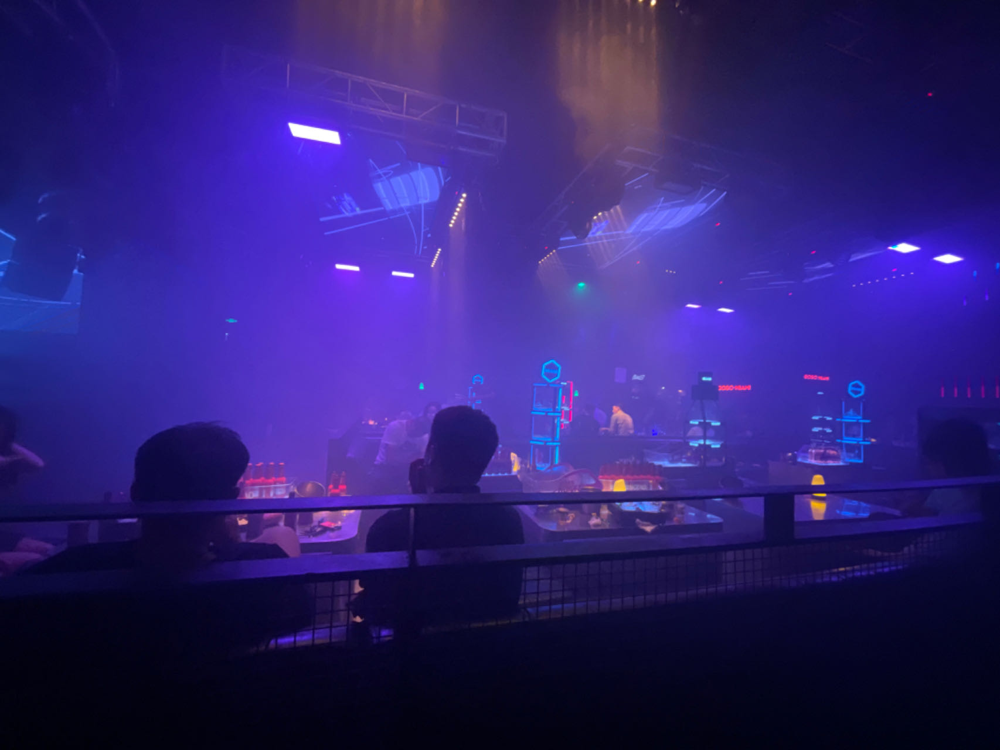

# 青岛旅游

## 总体概括

- 住宿环境比较差，但胜在便宜；
- 一共花了不到800，感觉也还行；
- 人多旅游是真的烦，特别是有些人事巨多，自我感觉一对情侣是一个比较好的搭配，再次就两对；
- 照片不是特别满意；

## 出行方式

### 租车自驾

- 好处：
  - 比高铁便宜，舒适性也还行；
  - 比较方便，不用打车和地铁，地铁太慢&打车太贵；
- 坏处：
  - 想要车好点，价格就会飞涨；
  - 停车太麻烦了，在一些比较繁华的城市和景区；
  - 需要水平非常高的司机；
  - 需要好多人来摊平成本，人少价格会贵很多；
  - 还车时间是固定的，在打破原定出行计划，想多玩几天时，成本也会飙升；
- 总结：**人少不推荐租车自驾**

## 饮食

- 主打一个众口难调，还是人多的麻烦；

- 吃了海鲜和路边小店，挺多想吃都没时间去品尝； 

  > 还是人太多了，没辙；
  
- 窜了好几天，给我难受坏了；

## 住宿

- 只能说，太差了，可以说是我前21年住的最差的环境了，除了便宜啥都不行；
- 去青岛玩，还是尽可能住到市南区、市北区吧，大部分景点都在那边；

## 玩乐

- 主要就去了琴屿路和第三海水浴场，都还行
- 去了一趟酒吧，详细地写在下面

## 酒吧

>  离开的前一晚，在酒吧写下

​		真正意义上的第一次酒吧之旅。（之前那次，都可以算是法老的一个小型演唱会了，虽然就唱了几首歌)。对于酒吧，昏暗的灯光，嘈杂的音乐，然后就是特别特别无聊（无聊到我正在写这个）。和我想象的差不多但又完全不一样。怎么评价呢？有钱人的名利场？形容的不是特别准确吧，但确实等级森严，钱多钱少完全是不一样的体验。200块，你能叫在旁边热舞的女性来陪酒聊天（大概是这个意思），更加大撒币一些，你会有更多体验解锁，这毋庸置疑。

> 思绪有点乱，完全不知道，该说啥

​		所有人都在压抑着不断膨胀的欲望，同时又在“小心翼翼”地释放，不知何时就会变成野兽。（打了个哈欠，连我坐的沙发都在抖）
> 有人搭讪被拒绝了，没啥好说，可能这就是酒吧的常态。

​		有点清醒和冷静，整个人和周遭环境格格不入，你要说我完全不喜欢吧，那不至于，完完全全放纵自己的欲望还是一个比较不一样的事情，毕竟最简单的快乐。但，哥们不喝酒呀，怎么融入这种地方呢？别说太满，还是这个地方没有我想要的那种气氛吧，哪怕是去放纵，去释放欲望，提不起来一点点兴趣。
> 骨子里还是有一些含蓄在的

​		不喝酒限制了我，同时也保护了我。很多很多“游戏”，我是热衷于去体验，去尝试。但这些东西大不过我对于酒精的抵制。在我之前没那么清醒的时候，保护我没有更一步偏离轨道。
> 到后半场了吗？感觉有些人更加大胆和开放了…
> 好无聊啊～

真和我不是一个世界的人啊～

## 遗憾

怎么能没有遗憾呢，好多地方还没去，好多地方还没逛；希望以后会和伴侣一起重新来一次吧
