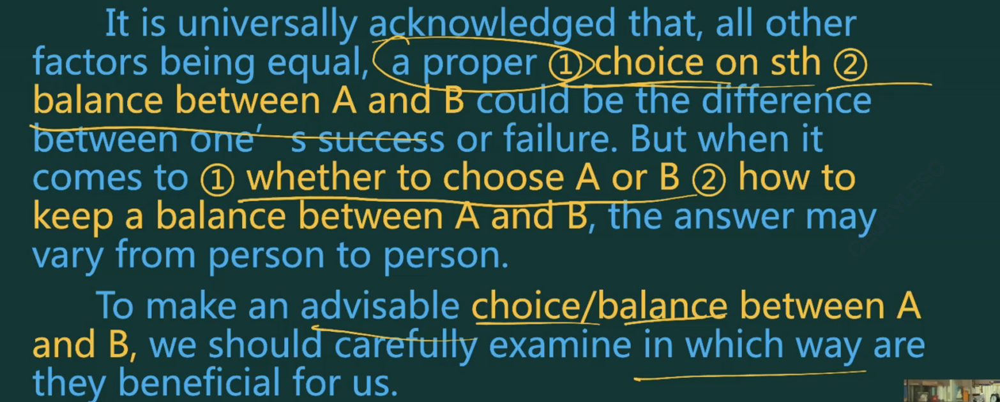
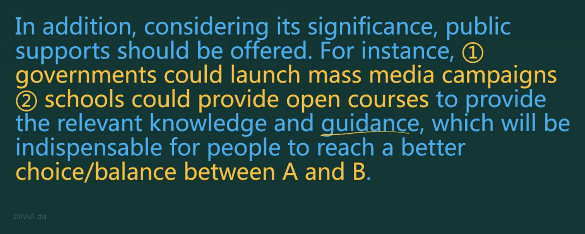
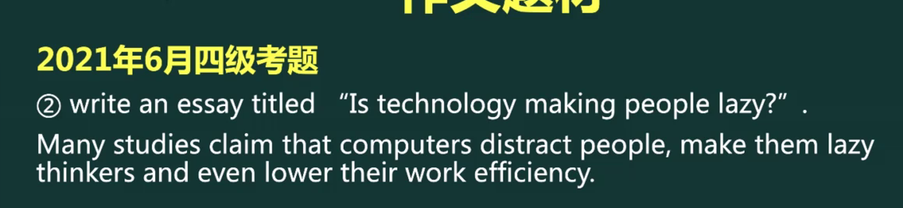

# 四六级作文

笔记源教程：[考研英语Monkey全心全意班](https://www.cctalk.com/m/group/90519927)

## 优秀品质技能类

### 框架

??? note "整体中文架构"

    首段：突出时代背景、明确该品质的重要性、重大影响
    
    第二段：通过三个分论点详细分析其正面意义 
       1. ta对个人的积极影响 
       2. ta对全社会的积极影响 
       3. 没有ta会带来什么负面影响
       
    末段: 总结其重要性,就如何推广这一种品质技能,给出建议 

### 中文模版

??? example "中文模版"

    

### 英文模版

??? example "英文模版"

    
    
    

### 例题

#### 写作能力的重要性

??? example "例文"

    

#### 员工雇主相互信任

??? example "例文"

    

#### 处理关系

##### 如何处理关系$\longrightarrow$优秀品质

??? tip "方法："

    三板斧：互相理解、互相尊重、互相信任
    
    build mutual understanding/respect/trust between A and B

#### 医患关系

??? question "题目"

    Write a short essay on how to best handle the relationship between doctors and patients.

??? example "例文"

    With the enhancement of general competitiveness in China, people nowadays are increasingly aware of the importance of social harmony. And a good relationship between doctors and patients plays a crucial role in its development As far as I am concerned, the best way to forge such a relationship is to build mutual trust between them.  
    

## 选择平衡类

### 框架

??? note "中文框架"

    

#### 中文模版

??? example "中文模版"

    

### 英文模版

??? example "英文模版"

      
      
    

### 例题

#### 专业选择

??? example "选择理科专业还是文科专业"

    

#### 平衡学术

??? example "如何平衡学术与课外活动"

    

#### 例题—科技相关(2021年6月4级)

??? question "题目"

    === "科技成瘾"
        
    
    === "科技让人变懒"
        
        
    === "暴力游戏会让人变得暴力吗?"
        

??? example "例文"

    只是第一段，后面两段套用优秀品质的模版
    
    === "科技成瘾"
        
    
    === "科技让人变懒"
        
        
    === "暴力游戏会让人变得暴力吗?"
        

## 图表作文

### 中文模版

??? example "中文模版"

    

### 英文模版

??? example "英文模版"

    
    

### 例题—2021年6月6级

??? question "题目"

    === " China's achievements in higher education"
        
        
    === "China's achievements in poverty alleviation"
        

??? example "例文"

    === " China's achievements in higher education"
        
        
    === "China's achievements in poverty alleviation"
        

