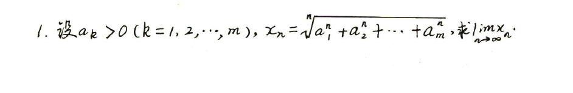
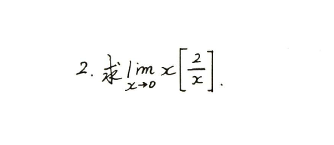
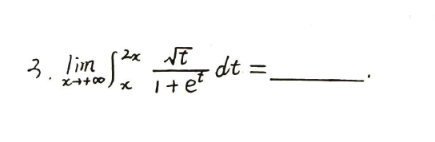
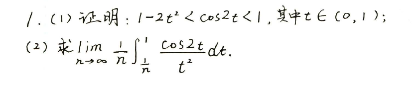
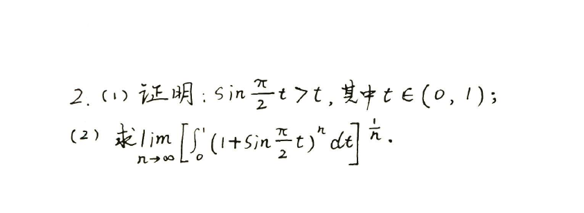
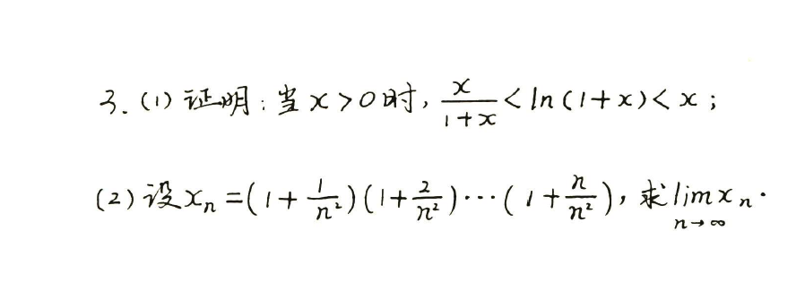

# 139高数错题记录

## 第一章 极限

### 考法1 求7种未定式的常识

| 错题                                                | 错因                                                         |
| --------------------------------------------------- | :----------------------------------------------------------- |
| [`A组 2(1)`](./pic/Question_139高数_1.1_A_2(1).png) | 三角函数诱导公式                                             |
| [`A组 2(2)`](./pic/Question_139高数_1.1_A_2().png)  | 三角函数诱导公式                                             |
| [`B组 1(2)`](./pic/Question_139高数_1.1_B_1(2).png) | $x\Rightarrow 0$与$x \Rightarrow \infty$是不一样的两种情况，想当然尔了 |
| [`B组 1(3)`](./pic/Question_139高数_1.1_B_1(3).png) | ${a}^{x}$的麦克劳林式不记得了                                |
| [`B组 1(5)`](./pic/Question_139高数_1.1_B_1(5).png) | 没思路                                                       |
| [`B组 1(6)`](./pic/Question_139高数_1.1_B_1(6).png) | 没思路                                                       |

??? question "错题"

    `A 2(1)` .png) 
    `A 2(2)` .png) 
    `B 1(2)` .png) 
    `B 1(3)` .png) 
    `B 1(5)` .png) 
    `B 1(6)` .png) 

??? note "知识点"

    $A组 2(1)\Rightarrow\cot(α+\frac{\pi}{2})=-\tan α$ 
    $A组 2(2)\Rightarrow\tan(α+\frac{\pi}{2})=-\cot α$ 
    $B组 1(3)\Rightarrow a^x = 1+ x\ln{a} + \frac{1}{2}{(x\ln{a})}^2 + \frac{1}{6}{(x\ln{a})}^3 + o(x^3) = \sum\limits_{n=0}^{\infty}\frac{{(x\ln{a})}^n}{n!}$

### 考法2 利用等价无穷小代换求极限

| 错题       | 错因 | 知识点 |
| :--------- | ---- | :----- |
| [`A组 1(2)`](./pic/Question_139高数_1.2_A_1(2).png) | $1-\cos x$的展开式搞错了 | $\cos x = 1 - \frac{1}{2}x^2 + \frac{1}{24}x^4 + o(x^4) = \sum\limits_{n=0}^{\infty}(-1)^{n}\frac{x^{2n}}{(2n)!}$ |
| [`A组 1(3)`](./pic/Question_139高数_1.2_A_1(3).png) | 想节省步骤，然后粗心搞错了正负号 |        |
| [`A组 1(4)`](./pic/Question_139高数_1.2_A_1(4).png) | 方法错误 |        |
|`A组 1(6)`|去括号过程中正负号搞错||
|`A组 1(9)`|有疑问，未解决||
|`A组 1(10)`|往下抄式子，少写一个负号||
|`B组 1(1)`|和`A组（9）`一样的问题||
|`B组 1(2)`|和`A组 1(4)`一样||
|`B组 1(4)`|方法错了，解不出来||
|`B组 1(5)`|没思路||
|`B组 1(7)`|没思路||

??? question "错题"

    `A组 1(2)` .png) 
    `A组 1(3)` .png) 
    `A组 1(4)` .png) 

### 考法3 利用泰勒公式求极限

| 错题       | 错因                                                         | 知识点 |
| ---------- | ------------------------------------------------------------ | ------ |
| `A组 1(2)` | 算错                                                         |        |
| `A组 2`    | 对带拉格朗日型余项的泰勒公式不熟悉                           | $?$    |
| `A组 4(1)` | 提括号，把正负号搞错                                         |        |
| `A组 5(1)` | 展开不够彻底                                                 |        |
| `A组 5(4)` | 展开不够彻底                                                 |        |
| `A组 5(5)` | 方法选难了，泰勒展开漏了一项                                 |        |
| `A组 6(2)` | 纯粗心了，当$x \rightarrow 0$，把$\sin{x}$记作$1$了          |        |
| `A组 6(3)` | 通分把分子正负搞错了                                         |        |
| `A组 7(2)` | 觉得$x \rightarrow 0，\cos{x}=1$，就没展开$\cos{x}$          |        |
| `A组 7(3)` | 与`A组 7(2)`一样的问题                                       |        |
| `B组 1(5)` | 指数函数的计算搞错了，$x^{\frac{3}{2}}$提取一个$x^{\frac{1}{2}}$,我算成$e^{3}$了 |        |

### 考法4 洛必达法则

| 错题       | 错因         | 知识点 |
| ---------- | ------------ | ------ |
| `B组 2(2)` | 正负号搞错了 |        |

### 考法5 幂指函数求极限·

| 错题       | 错因 | 知识点 |
| ---------- | ---- | ------ |
| `A组 1(5)` |      |        |
|`A组 1(7)`|||
|`B组 1(2)`|||
|`B组 4`|||
|`B组 7`|||
|`B组 8`|||

### 考法6 利用中值定理求极限

|                    |      |
| ------------------ | ---- |
| `拉格朗日中值定理` |      |
| `柯西中值定理`     |      |

### 考法7 无穷小阶的比较或确定

| 错题       | 错因 | 知识点 |
| ---------- | ---- | ------ |
| `A组 7`    |      |        |
| `A组 8`    |      |        |
| `B组 1`    |      |        |
| `B组 4`    |      |        |
| `B组 5(3)` |      |        |
| `B组 8`    |      |        |

### 考法8 已知极限反求参数

| 错题     | 错因                                                         | 知识点 |
| -------- | ------------------------------------------------------------ | ------ |
| `B组 1`  | 麦克劳林公式的适用条件搞错了，$\sqrt{1+{\Box}}$，想用泰勒展开，$\Box$必须$=0$ |        |
| `B组 4`  | 没思路                                                       |        |
| `B组 5`  | 计算错误                                                     |        |
| `B组 7`  | 变限积分不熟悉                                               |        |
| `B组 10` | 定积分的计算不熟练                                           |        |
| `B组 12` |                                                              |        |

### 考法9 利用夹逼准则求极限

| 错题                                          | 错因 | 知识点 |
| --------------------------------------------- | ---- | ------ |
| [`A组 1`](./pic/Question_139高数_1.9_A_1.png) |      |        |
| [`A组 2`](./pic/Question_139高数_1.9_A_2.png) |      |        |
| [`A组 3`](./pic/Question_139高数_1.9_A_3.png) |      |        |
| [`B组 1`](./pic/Question_139高数_1.9_B_1.png) |      |        |
| [`B组 2`](./pic/Question_139高数_1.9_B_2.png) |      |        |
| [`B组 3`](./pic/Question_139高数_1.9_B_3.png) |      |        |

??? question "错题"

    `A1` 
    `A2`  
    `A3`  
    `B1`  
    `B2`  
    `B3` 

### 考法10 利用定积分定义求极限

| 错题                                           | 错因           |
| ---------------------------------------------- | -------------- |
| [`A组 4`](./pic/Question_139高数_1.10_A_4.png) | 积分公式没记熟 |
| [`A组 6`](./pic/Question_139高数_1.10_A_6.png) | 定积分算错了   |
| [`A组 7`](./pic/Question_139高数_1.10_A_7.png) | 没思路         |
| [`A组 8`](./pic/Question_139高数_1.10_A_8.png) | 定积分算错了   |
| [`B组 3`](./pic/Question_139高数_1.10_B_3.png) | 没思路         |
| [`B组 6`](./pic/Question_139高数_1.10_B_6.png) | 没思路         |

??? question "错题"

    `A4`  
    `A6`  
    `A7`  
    `A8`  
    `B3`  
    `B6` 

??? note "知识点"

    $\int_{a}^{b}f(x)=\lim\limits_{x\to∞}\sum_{i=1}^{n}f(a+\frac{b-a}{n}i)\frac{b-a}{n}$，当$a=0,b=1$时，有$\int_{0}^{1}f(x){\mathrm{d} x}=\lim\limits_{0\to\infty}f(\frac{i}{n})\frac{1}{n}=\lim\limits_{0\to\infty}{\frac{1}{n}}[f(\frac{1}{n})+f(\frac{2}{n})+{\ldots}+f(\frac{n}{n})]$

$\int_{a}^{b}f(x)=\lim\limits_{x\to∞}\sum_{i=1}^{n}f(a+\frac{b-a}{n}i)\frac{b-a}{n}$，当$a=0,b=1$时，有$\int_{0}^{1}f(x){\mathrm{d} x}=\lim\limits_{0\to\infty}f(\frac{i}{n})\frac{1}{n}=\lim\limits_{0\to\infty}{\frac{1}{n}}[f(\frac{1}{n})+f(\frac{2}{n})+{\ldots}+f(\frac{n}{n})]$

