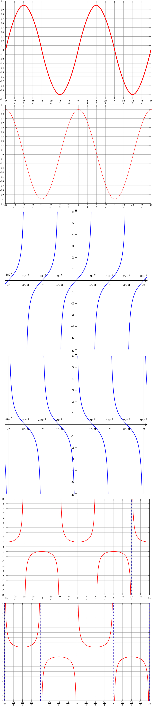

# 公式测验

## 导数

$(C){’} =

$(X^{\mu}){’} $ 

$(\sqrt{x}){’} $ 

$(\frac{1}{x}){’} = -\frac{1}{x^2}$ 

$(e^{x}){’} =e^{x}$ 

$(a^{x}){’} =a^{x}\ln{a}$ 

$(\ln{x}){’} =\frac{1}{x}$ 

$(\log_{a}{x}){’} =\frac{1}{x\ln{a}}$ 

$[\ln{(x+\sqrt{x^2+a^2})}]{’} =\frac{1}{\sqrt{a^2+x^2}}$ 

$(\sin{x}){’} =\cos{x}$ 

$(\tan{x}){’} =\sec^2{x}$ 

$(\sec{x}){’} =\sec{x}\tan{x}$ 

$(\cos{x}){’} =-\sin{x}$ 

$(\cot{x}){’} =-\csc^2{x}$ 

$(\csc{x}){’} =-csc{x}cot{x}$ 

$(\arcsin{x}){’} =\frac{1}{\sqrt{1-x^2}}$ 

$(\arccos{x}){’} =-\frac{1}{\sqrt{1-x^2}}$ 

$(\arctan{x}){’} =\frac{1}{1+x^2}$ 

$(\text{arccot}\ x){’} =-\frac{1}{1+x^2}$ 

## 三角函数

$y=\sin x$

$y=\cos x$

$y=\tan x$

$y=\cot x$

$y=\sec x$ 

$y=\csc x$

上述函数的对称轴、对称中心、图像

    
上述函数的图像

    

        
    

### 诱导公式

> 奇变偶不变，符号看象限。

$\sin(α+2kπ)=\sin α$ $\cos(α+2kπ)=\cos α$ $\tan(α+2kπ)=\tanα$ $\cot(α+2kπ)=\cotα$  

$\sin(-α)=-\sinα$ $\cos(-α)=cos α$ $\tan(-α)=-\tan α$ $\cot(-α)=-cot α$ 

$\sin(α+π)=-\sin α$ $\cos(α+π)=-\cos α$ $\tan(α+π)=\tan α$ $\cot(α+π)=cot α$ 

$\sin(π-α)=\sin α$ $\cos(π-α)=-\cos α$ $\tan(π-α)=-\tan α$ $\cot(π-α)=-\cot α$ 

$\sin(α+\frac{\pi}{2})=\cos α$ $\cos(α+\frac{\pi}{2})=-\sin α$ $\tan(α+\frac{\pi}{2})=-\cot α$ $\cot(α+\frac{\pi}{2})=-\tan α$ 

$\sin(\frac{\pi}{2}-α)=\cos α$ $\cos(\frac{\pi}{2}-α) =\sin α$ $\tan(\frac{\pi}{2}-α)=\cot α$ $\cot(\frac{\pi}{2}-α)=\tan α$ 

### 两角和与差

$\cos(\alpha + \beta) =\cosα\cosβ-\sinα\sinβ $

$\cos{(\alpha - \beta)} =\cos{\alpha}\cos{\beta}+\sin{\alpha}\sin{\beta} $

$\sin{(\alpha + \beta)} =\sin{\alpha}\cos{\beta}+cos{\alpha}\sin{\beta} $

$\sin{(\alpha - \beta)} = \sin{\alpha}\cos{\beta}-\cos{\alpha}\sin{\beta}$

$\tan{(\alpha + \beta)} = \frac{\tan{\alpha}+\tan{\beta}}{1-\tan{\alpha}\tan{\beta}}$

$\tan{(\alpha - \beta)} = \frac{\tan\alpha - \tan\beta}{1 + \tan\alpha\tan\beta}$

### 和差化积

$\sin\alpha + \sin\beta =  2\sin(\frac{\alpha + \beta}{2})\cos(\frac{\alpha - \beta}{2})$

$\sin\alpha - \sin\beta = 2\sin(\frac{\alpha - \beta}{2})\cos(\frac{\alpha + \beta}{2})$

$\cos\alpha + \cos\beta = 2\cos(\frac{\alpha + \beta}{2})\cos(\frac{\alpha - \beta}{2})$

$\cos\alpha - \cos\beta = -2\sin(\frac{\alpha + \beta}{2})\sin(\frac{\alpha - \beta}{2})$

### 积化和差

$\cos\alpha\sin\beta = \frac{1}{2}[\sin{(\alpha + \beta)} - \sin{(\alpha - \beta)}]$

$\sin\alpha\cos\beta = \frac{1}{2}[\sin{(\alpha + \beta)} + \sin{(\alpha - \beta)}]$

$\cos\alpha\cos\beta = \frac{1}{2}[\cos{(\alpha + \beta)} + \cos{(\alpha - \beta)}]$

$\sin\alpha\sin\beta = -\frac{1}{2}[\cos{(\alpha + \beta)} - \cos{(\alpha - \beta)}]$

### 二倍角公式

$\sin{2\alpha} = $

$\cos{2\alpha} = $

$\tan{2\alpha} = $

$\cot{2\alpha} = $

$\sec{2\alpha} = $

$\csc{2\alpha} = $

### 降幂公式

$\sin^2\alpha = $

$\cos^2\alpha = $

$\tan^2\alpha = $

### 辅助角公式

$a\sin\alpha + b\cos\alpha =$

$其中\ \varphi\ 满足\ \cos\varphi = ，\sin\varphi = $

### 万能公式

$\sin\alpha = $

$\cos\alpha = $

$\tan\alpha = $

## 反三角函数

$\arcsin{x} $

$\arccos{x}$ 

$  \arctan{x}$

${\mathrm{arccot} {x}}$  

所有反三角函数的定义域、值域、图像:

## 积分公式

$\int{x^{\mu}dx} = $

$\int{\frac{1}{\sqrt{x}}dx} = $

$\int{e^x dx} = $

$\int{a^x dx} = $

$\int{\frac{1}{x}dx} = $

$\int{\sin{x}dx} = $

$\int{\cos{x}dx} = $

$\int{\tan{x}dx} = $

$\int{\cot{x}dx} = $

$\int{\sec^2{x}dx} = $

$\int{\csc^2{x}dx} = $

$\int{\frac{dx}{\sqrt{1-x^2}}} = $

$\int{\frac{dx}{1+x^2}} = $

$\int{\sec{x}dx} = $

$\int{\csc{x}dx} = $

$\int{\frac{1}{\sqrt{a^2 - x^2}}dx} = $

$\int{\frac{1}{a^2 + x^2}dx} = $

$\int{\frac{1}{\sqrt{x^2 \pm a^2}}dx} = $

$\int{\frac{1}{1 + e^x}dx} = $

$\int{\frac{1}{a^2 - x^2}dx} = $

$\int{\sqrt{x^2 + a^2}dx} = $

$\int{\sqrt{x^2 - a^2}dx} = $

$\int{\sqrt{a^2 - x^2}dx} = $

## 麦克劳林公式

$\sin {x}$

$\arcsin x$

$\tan x = $

$\arctan x = $

$\cos x = $

$\ln(1+x) = $

$e^x = $

$(1+x)^a = $

$\frac{1}{1+x} = $

$\frac{1}{1-x} = $

$\sqrt{1+x} =  $

$\frac{1}{\sqrt {1+x}} = $

### 重要差函数

$x - \sin{x} \sim $

$\arcsin{x} - x \sim $

$1 - \cos{x} \sim $

$x - \ln{(1+x)} \sim $

$\tan{x} - x \sim $

$e^x - 1 \sim $

$e^x - 1 - x \sim $

$\tan{x} - \sin{x} \sim $

推广：$\tan{f(x)} - \sin{f(x)} \sim $

$\arctan{x} - \arcsin{x} \sim $

> 注意：$f(x) \pm g(x) = cx^k + o(x^k)$ ，而 $f(x) \pm g(x) \sim $ 。
