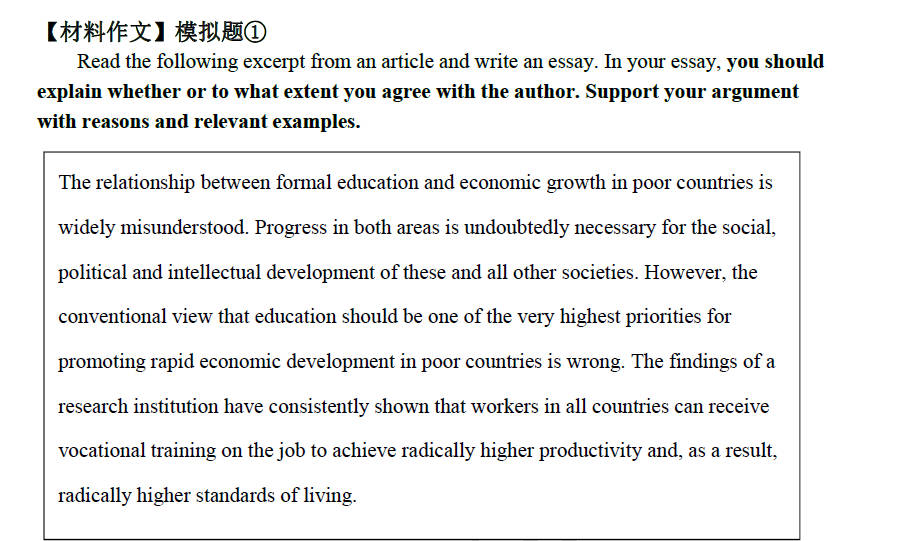
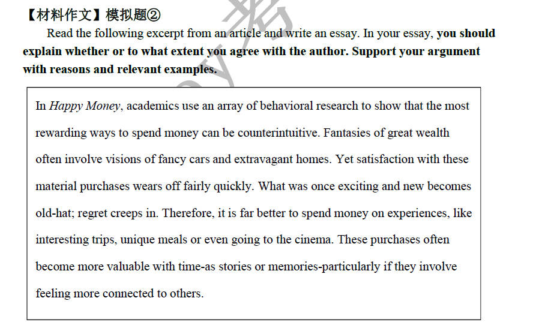
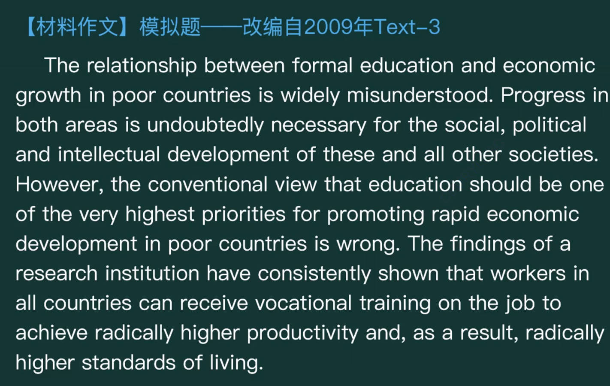
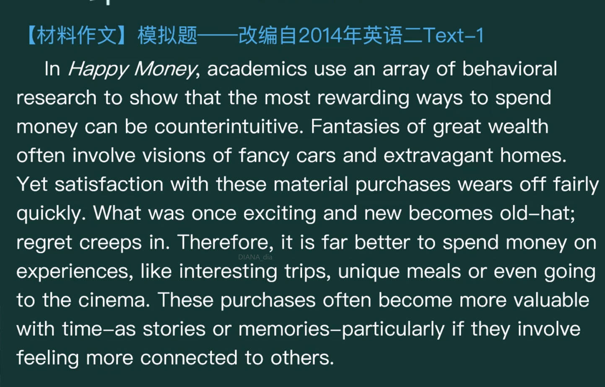

# 考研大作文

> 笔记源教程：[考研英语Monkey全心全意班](https://www.cctalk.com/m/group/90519927)

## 材料类作文

### 中文模版

??? example "中文模版"

    主线: 描述作者观点一自己对其部分认同一认同的理由一不认同的理由一总结
    
    在以上材料中，作者声称[作者结论句] 。虽然这一论点在某种意义上有可取之处，但是考虑到作者是在一个过分简化的基础上得出这样一种宽泛的论断的我只能部分同意其观点。  
    
    一方面，虽然作者的观点存在一些问题，但在某些情况下确实符合我们的常识或经验。① (一般品质、事理类) 从《奥德赛》到《史记》，从孔子到柏拉图，能例证这一观点的隽永故事与箴言不胜枚举。② (现代背景类) 从日常推送到我手机屏幕上的新闻到微信朋友圈里的日常生活内容，作为一个Z世代人和年轻的数码原住民，我近距离地经历了和见证了太多的可以例证这一观点的事例③自行发挥举例。
    
    另一方面，我必须指出，作者过分简化了事情发生的情景和相关变量。考虑到其独特且多样的背景，人们/事态 未必会按作者所想的那样 行动/反应/发展。
    
    综上所述，上述话题甚为复杂，因而也并不存在一个直白或绝对的答案。在我看来，考虑到这一问题的复杂性，具体情况具体分析无疑是更明智的办法

### 英文模版

??? example "英文模版："

    In the excerpt above, the author generally asserts that 作者结论句. While this argument does have some merit in a way, considering that the author comes to this broad assertion on an oversimplified basis, I can only partially agree with his opinion.
    
    On the one hand, i would like to admit that the author's statement, although suffering from certain flaws, is sensible some cases, where the implicit rationale behind it accords with the common sense and empirical evidence in our daily life.①(一般品质、事理类) From the Odyssey to the Historical Records, from Confucius to Plato, instructive stories and thought-provoking proverbs that could exemplify this perspective are too numerous to count.② (现代背景类)From the news stories pushed to my screen to the daily lives posted on the WeChat Moments, as a Generation Z and young digital native, I have intimately experienced and witnessed numerous cases that could exemplify this perspective. ③自行发挥举例
    
    On the other hand, l am bound to point out that the author oversimplifies the context and relevant variables. Given their distinctive and diverse background, it is not surprising to discover that people/the course of events may not necessarily act/react/develop in accordance with the author's presumption.
    In conclusion, the issue mentioned above is a complex one. and there are no simple or absolute answers to it. From my perspective, given its complicated nature, it is certainly more advisable to take a case-by-case approach.

### 作者结论句总结

### 例文

??? question "例题"

    === "2023 大纲模拟题 英一"
        
    
    === "2023 大纲模拟题 英二"
        
        
    === "模拟题 根据2009 text 3改编"
        
        
    === "模拟题 根据2014 英二 text 1改编"
        

??? example "作者结论句："

    === "2023 大纲模拟题 英一"
        In the excerpt above,  the author generally asserts that failure in "expertise" can be compensated by higher integrity and benevolence.
    
    === "2023 大纲模拟题 英二"
        In the excerpt above, the author generally asserts that the right to wander is taken away from children,and this is why technology attracts many of our youth. 
        
    === "根据2009 text 3改编"
        In the excerpt above, the author generally asserts that the conventional view that one of the very highest priorities for promoting rapid economic development in poor countries should be education is wrong. /education should not be one of the very highest priorities for promoting rapid economic development in poor countries. 
        
    === "根据2014 英二 text 1改编"
        In the excerpt above, the author generally asserts that it is far better to spend money on experiences, like interesting trips, unique meals or even going to the cinema./it is far better to spend money on experiences than on material purchases.

### 图画类作文

### 图表类作文
