# 考研小作文

笔记源教程：[考研英语Monkey全心全意班](https://www.cctalk.com/m/group/90519927)

## 首段—表达写信的目的：

??? note "首段"

    1. 次要目的（客套礼节）+主要目的（题干重点描写要求的部分） 
       Dear Xx,（首字母都要大写，结尾是逗号，） 
       I am writing this letter to... / This notice is to... 
       亲爱的xx，我写这封信是为了/本公告是为了 
    2.  次要目的（感谢、祝贺、道歉等纯粹情感性的目的，未必会有）： 
       thank you for.../congratulate you for.../apologize for.../do sth, and to 
        为…而感谢你/祝贺你/向你道歉/其他目的，并且 
    3. 主要目的（提建议、意见，介绍信息，进行推荐...文章的核心主旨）： 
       ①offer you some suggestions/information about sth/how to do sth. 
       给出关于 某事/如何做某事的 建议/信息 
       ② extend you an invitation to do sth. 
        邀请你做某事 
       ③ recommend you sth 
        推荐给你某事物 
       ④ do sth 
       做某事

## 尾段—表达对读信人的期望：

??? note "尾段"

    按是否需要对方回信分为以下两种（部分题目回不回信都可以）
    
    1. 否：（公告、招募、问询…）→没有需求，创造需求 
       
    I would be glad if you found the  information/suggestions mentioned above helpful.
    Should you have any further questions, please feel free to contact me. 
    
    
Yours truly,  Li Ming
 
    
    希望以上 信息/建议对你有用。如果有其它问题，请随时与我联系。
    
    
你诚挚的， 李明

    
    2. 是：（建议、介绍、推荐、感谢、道歉、邀请、投诉、申请…）→期待回复 
      I would appreciate it if you could take my  complaint / application / resignation /recommendation / invitation / questions into serious consideration.
      And I would be much obliged to you for an early and positive reply. 
      
      
Yours truly,  Li Ming
 
    
      希望你能重视或认真考虑我的 投诉/申请/辞职/建议/邀请/问题。如能早日得到你的积极回复，我将不胜感谢。 
    
    
你诚挚的， 李明

## 第二段—主体段

### 整体架构

??? note "整体架构："

    Regarding... , there are several points I would like to mention. 
    First of all, 论点1. 
    What’s more, 论点2. 
    In addition, 论点3. 
    For more details, you could refer to the attachment below. （28 词）

### 具体论点

三元：是什么（说明介绍）、为什么（原因利弊）、怎么办（建议意见）

??? note "三元"

    1. 是什么（以说明介绍活动信息为主）：
    
        1. 时间、地点：  
           他将于下周日在主楼举行/它位于主楼里（旁边）/我们下周日在主楼集合并前往目的地（请保证届时你有时间参加） 
             it will be held / it is located in (beside) the Main Building (next Sunday)/ we will gather in the Main Building next Sunday and set off to the spot (, and please make sure you are available then).
        2. 出席人物： 
           我们的工作人员届时将会为你提供一些必要的培训/介绍/引导  
           our staff will be there to provide you (with) necessary orientation/guidance.
        3. 着装要求：  
           出席活动时，着装应该得体/暖和/朴素 
            it is highly recommended to be properly/warmly/plainly dressed for the occasion.
    
    2. 为什么（分析利弊）:
    
        1.  权威认可：
             - ta获得了权威机构的官方奖项/资质/认可... 
               have (has) an official award / qualification / recognition from the authority.
             - 被授予联合国物质/非物质文化遗产称号。 
               are (is) awarded with the title of Material / Intangible Cultural Heritage from the United Nations.
        2. 群众基础： 
             人民群众/很多社交媒体平台对ta很欢迎/评价很高/很关注担心 
             enjoy (enjoys) a widespread popularity / reputation / concern among 人民群众/on multiple social platforms.
        
        3. 个人喜欢： 
            我个人觉得xx很有吸引力/有趣/有益/必要 
            I personally find it attractive / interesting / beneficial / necessary to do sth.
    
    3. 怎么办（建议意见）：
        1. 端正认识： 
              端正认识，并建立起关于xx的正确价值观是首要任务 
              it’s advisable to put things into perspective and establish correct values about sth primarily.
        2. 实践经验： 
            你可以在知乎社区上寻找该领域的相关/先进/国际/历史经验 
            you could look for relevant / advanced / international / historical experience in this aspect on Zhihu Community.
        3. 知行合一： 
            应该及时制定合理、可行的计划并优先执行 
            a practical and reasonable plan should be promptly carried out and remain high on your agenda.

## 中文模板

??? example "中文模版"

    亲爱的xx，我写这封信/本公告是 为…而感谢你/祝贺你/向你道歉/其他目的，并且给出关于 某事/如何做某事的 建议/信息/ 邀请你做某事/ 推荐给你某事物//做某事。
    
    主段（三个方面）：
    
    - 是什么（以说明介绍活动信息为主）： 关于……，有几点我想提一下。首先，他将于下周日在主楼举行/它位于主楼里（旁边）/我们下周日在主楼集合并前往目的地（请保证届时你有时间参加）。更重要的是，我们的工作人员届时将会为你提供一些必要的培训/介绍/引导。另外，出席活动时，着装应该得体/暖和/朴素。欲了解更多详情，您可以参考下面的附件。
     - 为什么（分析利弊）： 关于……，有几点我想提一下。首先，ta获得了权威机构的官方奖项/资质/认可。/首先，ta被授予联合国物质/非物质文化遗产称号。更重要的是，人民群众/很多社交媒体平台对ta很欢迎/评价很高/很关注担心。另外，我个人觉得xx很有吸引力/有趣/有益/必要。欲了解更多详情，您可以参考下面的附件。
    - 怎么办（建议意见）： 关于……，有几点我想提一下。首先，端正认识，并建立起关于xx的正确价值观是首要任务。更重要的是，你可以在知乎社区上寻找该领域的相关/先进/国际/历史经验。另外，你应该及时制定合理、可行的计划并优先执行。欲了解更多详情，您可以参考下面的附件。
    
    尾段（是否需要回信分两种）：
    
    - 否： 希望以上 信息/建议对你有用。如果有其它问题，请随时与我联系。
      
    
你诚挚的 李明

      
    - 是： 希望你能重视或认真考虑我的 投诉/申请/辞职/建议/邀请/问题。如能早日得到你的积极回复，我将不胜感谢。 
    
    
你诚挚的， 李明

## 英文模板

??? example "英文模版："

    Dear Xx,
    
    首段（写信的目的）：
    
    I am writing this letter to... / This notice is to..thank you for.../congratulate you for.../apologize for.../do sth, and to offer you some suggestions/information abou sth/how to do sth. extend you an invitation to do sth. recommend you sth. /do sth.For more details, you could refer to the attachment below. 
    
    主段（三个方面）：
    
    - 是什么（以说明介绍活动信息为主）： Regarding... , there are several points I would like to mention. First of all,  it will be held / it is located in (beside) the Main Building (next Sunday)/ we will gather in the Main Building next Sunday and set off to the spot (, and please make sure you are available then). What's more, our staff will be there to provide you (with) necessary orientation/guidance. In addition, it is highly recommended to be properly/warmly/plainly dressed for the occasion. For more details, you could refer to the attachment below. 
    - 为什么（分析利弊）： Regarding... , there are several points I would like to mention. First of all, Xx have (has) an official award / qualification / recognition from the authority. /Xx are (is) awarded with the title of Material / Intangible Cultural Heritage from the United Nations. What's more, Xx enjoy (enjoys) a widespread popularity / reputation / concern among 人民群众/on multiple social platforms.In addition, I personally find it attractive / interesting / beneficial / necessary to do sth. For more details, you could refer to the attachment below. 
    - 怎么办（建议意见）： Regarding... , there are several points I would like to mention. First of all, it’s advisable to put things into perspective and establish correct values about sth primarily. What's more, you could look for relevant / advanced / international / historical experience in this aspect on Zhihu Community. In addition, Ia practical and reasonable plan should be promptly carried out and remain high on your agenda. For more details, you could refer to the attachment below. 
    
    尾段（是否需要回信分两种）：
    
    - 否： I would be glad if you found the  information/suggestions mentioned above helpful. Should you have any further questions, please feel free to contact me. 
    
    
Yours truly,  Li Ming
 
    
    - 是： I would appreciate it if you could take my  complaint / application / resignation /recommendation / invitation / questions into serious consideration. And I would be much obliged to you for an early and positive reply. 
    
    
Yours truly,  Li Ming
 

## 例题：

### 说明介绍型：2019英一

??? question "题目："

    Suppose you are working for the “Aiding Rural Primary Schools?project of your university. Write an email to answer the inquiry from aninternational student volunteer, specifying the details of the project. 
    You should write about 100 words on the ANSWER SHEET

??? info "解析："

    对方是谁? 	international student volunteer 
    是不是notice?	不是 
    次要目的是什么?	无 
    主要目的是什么? 	answer the inquiry, specifying the details of the project 
    信件的实质内容涉及三元中的哪些元素? 	是什么? 
    是否必须需要对方回信? 	否

??? example "例文："

    Dear International Volunteer. 
            I am writing this letter to answer your inquiry and specify the details of the “ Aiding Rural Primary Schools”project./I am writing this letter to offer you some information about the “AidingRural Primary Schoolsproject. 
            Regarding the project, there are several points I would mostly like tomention. First of all, we will gather in the Main Building next Sunday andset off to the rural primary school. What's more, our staff will be there to provide you with some necessary orientation. In addition, it is highly recommended to be plainly dressed for the occasion. For more details(about the project), you could refer to the attachment below. 
            I would be glad if you found the information mentioned abovehelpful. Should you have any further questions, please feel free to contactme. 
           
Yours truly,  Li Ming
 
        

    

### 分析利弊型：2017英一

??? question  "题目："

    You are to write an email to James Cook, a newly-arrived Australian professor, recommending some tourist attractions in your city. Please give reasons for your recommendation. 
    You should write about 100 words on the ANSWER SHEET

??? info "解析："

     对方是谁? 	James Cook, a newly-arrived Australian professor  
        是不是notice?	不是  
        次要目的是什么?	无  
        主要目的是什么? 	recommending some tourist attractions in your city  
        信件的实质内容涉及三元中的哪些元素? 	 为什么选ta  
        是否必须需要对方回信? 	否

??? example "例文："

    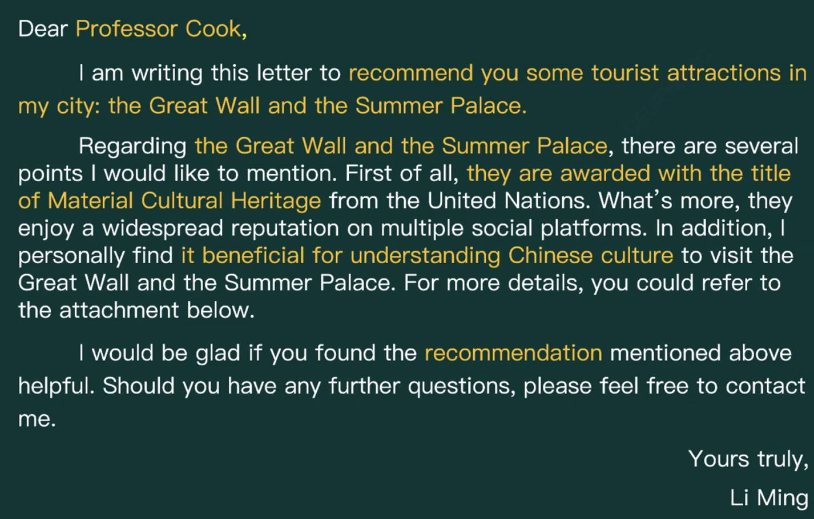

### 建议意见型：2016英二

??? question  "题目："

    Suppose you won a translation contest and your friend, Jack, wrote an email to
    congratulate you and ask for advice on translation. Write him a reply to 1) thank him,
    and 2) give your advice. 
    You should write about 100 words on the ANSWER SHEET

??? info "解析："

    对方是谁? 	your friend, Jack  
        是不是notice?	不是  
        次要目的是什么?	thank him  
        主要目的是什么? 	give your advice an translation  
        信件的实质内容涉及三元中的哪些元素? 	 怎么办  
        是否必须需要对方回信? 否

??? example "例文："

    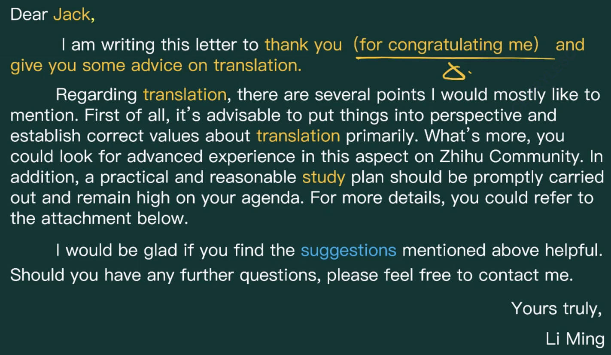

### 杂糅型：2019英二

??? question  "题目："

    Suppose Professor Smith asked you to plan a debate on the theme of city traffic. Write
    him an email to 1) suggest a specific topic with your reasons, and 2) tell him about
    your arrangements.  
    You should write about 100 words on the ANSWER SHEET

??? info "解析："

     对方是谁? 	Professor Smith  
        是不是notice?	不是  
        次要目的是什么?	无  
        主要目的是什么? 	1) suggest a specific topic with your reasons, and 2) tell him about your arrangements  
        信件的实质内容涉及三元中的哪些元素? 	 为什么选ta 是什么  
        是否必须需要对方回信? 否

??? example "例文："

    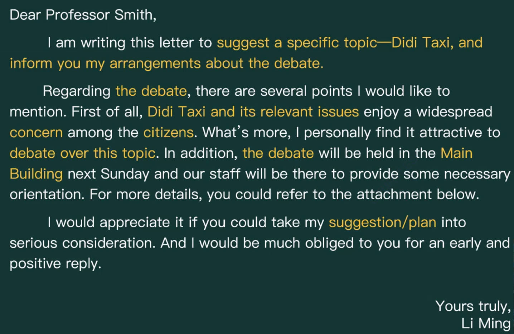

### 杂糅型：2020英二

??? question  "题目："

    Suppose you are planning a tour of a historical site for a group of international
    students. Write them an email to 1) tell them about the site, and 2) give them some
    tips for the tour.  
    You should write about 100 words on the ANSWER SHEET

??? info "解析："

     对方是谁? 	international students  
        是不是notice?	不是  
        次要目的是什么?	无  
        主要目的是什么? 	1) tell them about the site,  2) give them some tips for the tour  
        信件的实质内容涉及三元中的哪些元素? 	 为什么选ta 是什么  
        是否必须需要对方回信? 否

??? example "例文："

    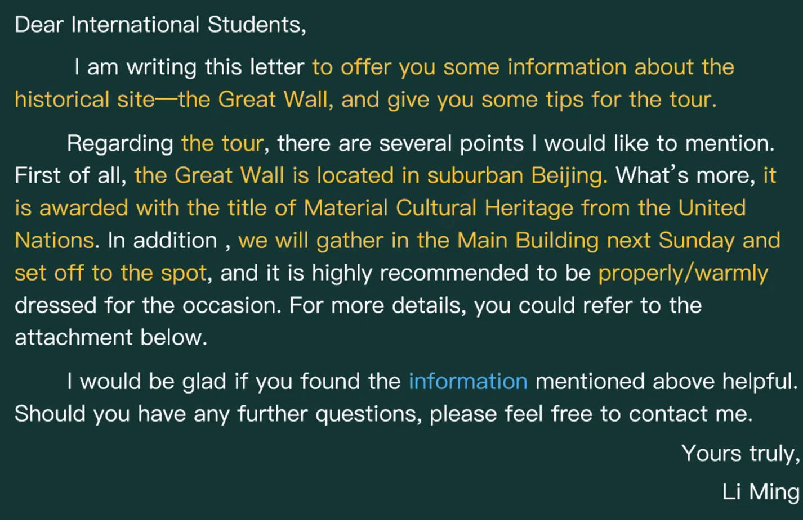

### 杂糅型：2022英一

??? question  "题目："

    Write an email to a professor at a British university, inviting him/her to organize a
    team for the international innovation contest to be held at your university.  
    You should write about 100 words on the ANSWER SHEET

??? info "解析："

     对方是谁? 	professor  
        是不是notice?	不是  
        次要目的是什么?	无  
        主要目的是什么? 	邀请他组队来参加你们学校的竞赛  
        信件的实质内容涉及三元中的哪些元素? 	 为什么选ta 是什么  
        是否必须需要对方回信? 是

??? example "例文："

    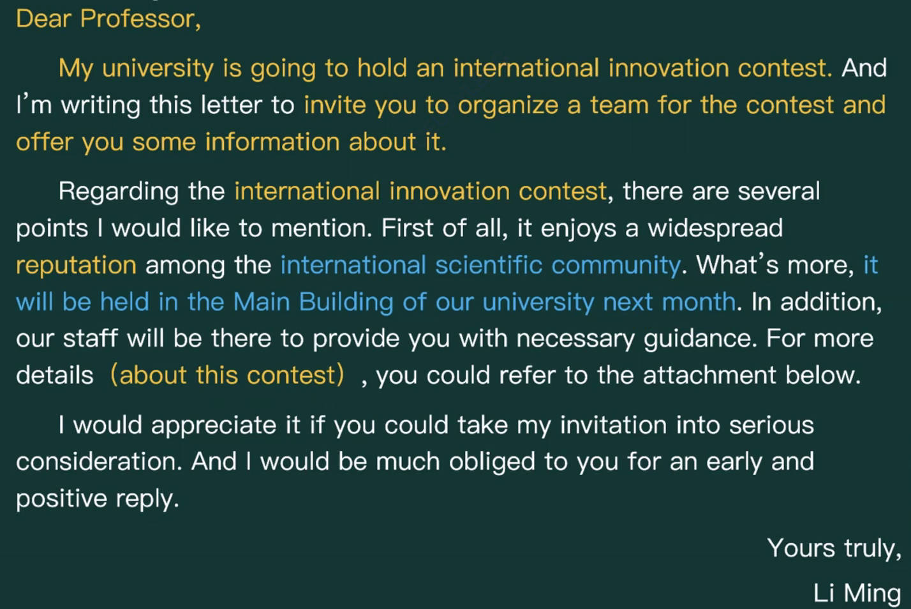

### 杂糅型—投诉信：2012英二

??? question  "题目："

    Suppose you have found something wrong with the electronic dictionary that you
    bought from an online store the other day. Write an email to the customer service
    center to 1) make a complaint, and 2) demand a prompt solution.  
    You should write about 100 words on the ANSWER SHEET

??? info "解析："

     对方是谁? 	customer service center  
        是不是notice?	不是  
        次要目的是什么?	无  
        主要目的是什么? 	1) make a complaint 2) demand a prompt solution  
        信件的实质内容涉及三元中的哪些元素? 	 为什么, 怎么办  
        是否必须需要对方回信? 是

??? example "例文："

    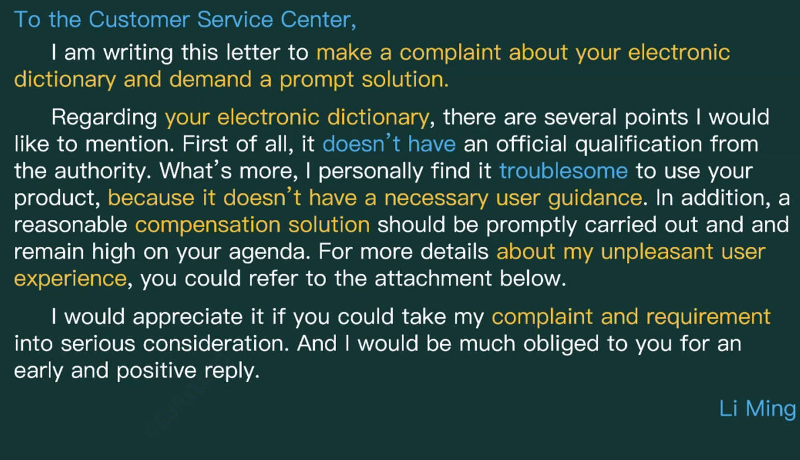

### 杂糅型—道歉信 

??? tip "2018"

    ??? info "解析："
        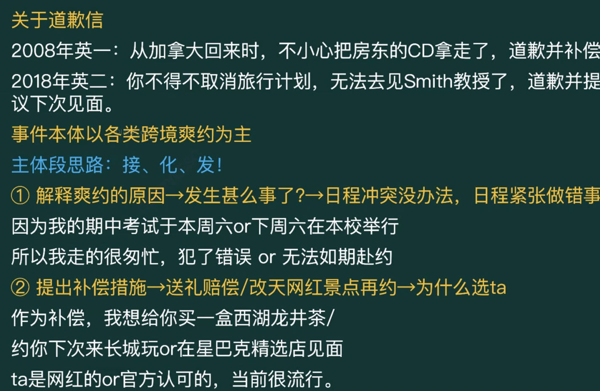
    
    === "英一"
        ??? question  "题目："
    
            You have just come back from Canada and found a music CD in yourluggage that you forgot to return to Bob, your landlord there. Write him a letter to 1) make a apology, and 2) suggest a solution. 
            You should write about 100 words on the ANSWER SHEET
    
        ??? example "例文："
            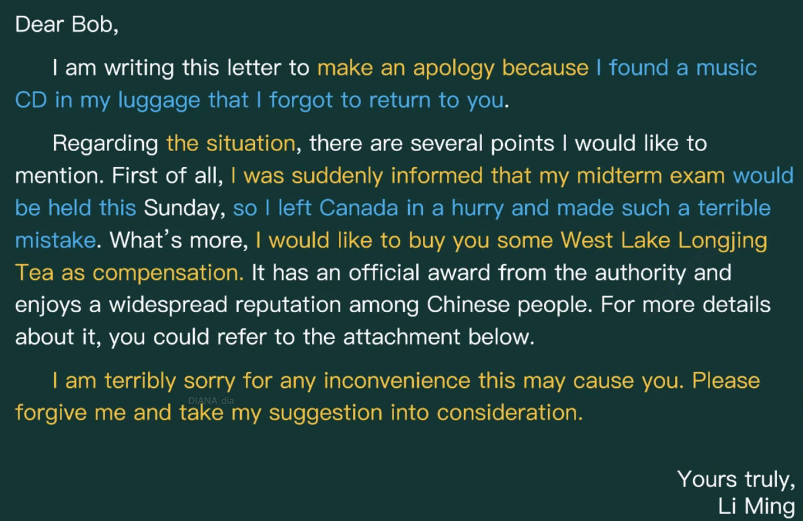
    
    === "英二"
        ??? question  "题目："
    
            Suppose you have to cancel your travel plan and will not be able to visit Professor Smith. Write him an email to 1) apologize and explain the situation, and 2) suggest a future meeting.  
            You should write about 100 words on the ANSWER SHEET
    
        ??? example "例文："
            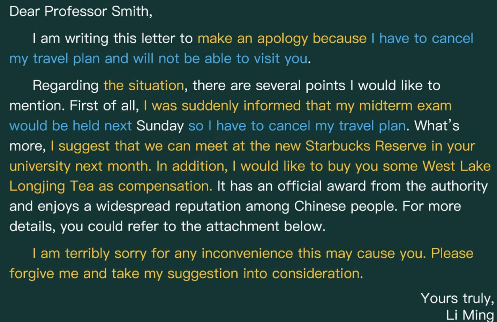

​    

### 告示回函：2023年大纲新增例题

??? question  "题目："

    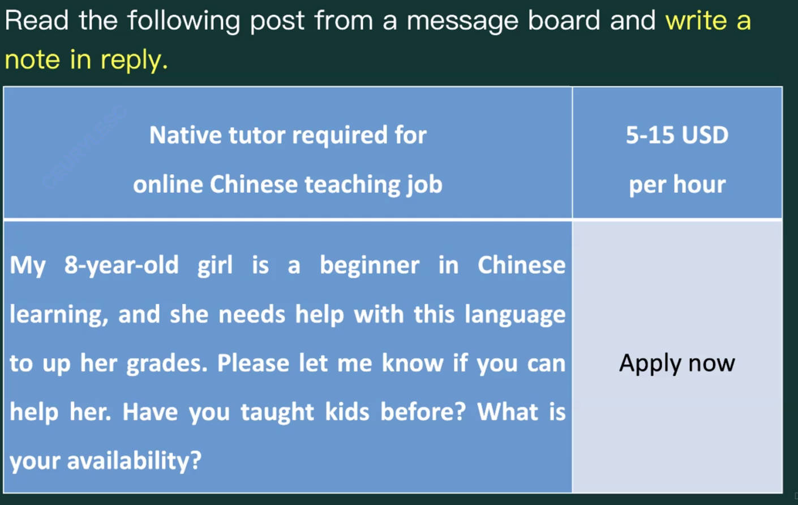

??? example "例文："

    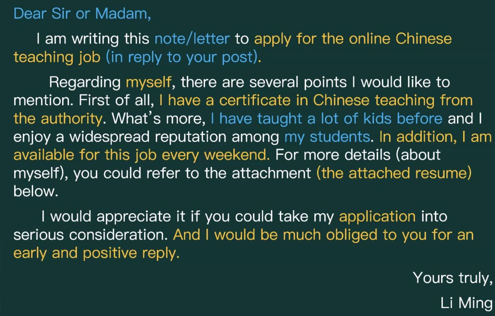

### 会议纪要：大概率不考

??? failure  "说明："

    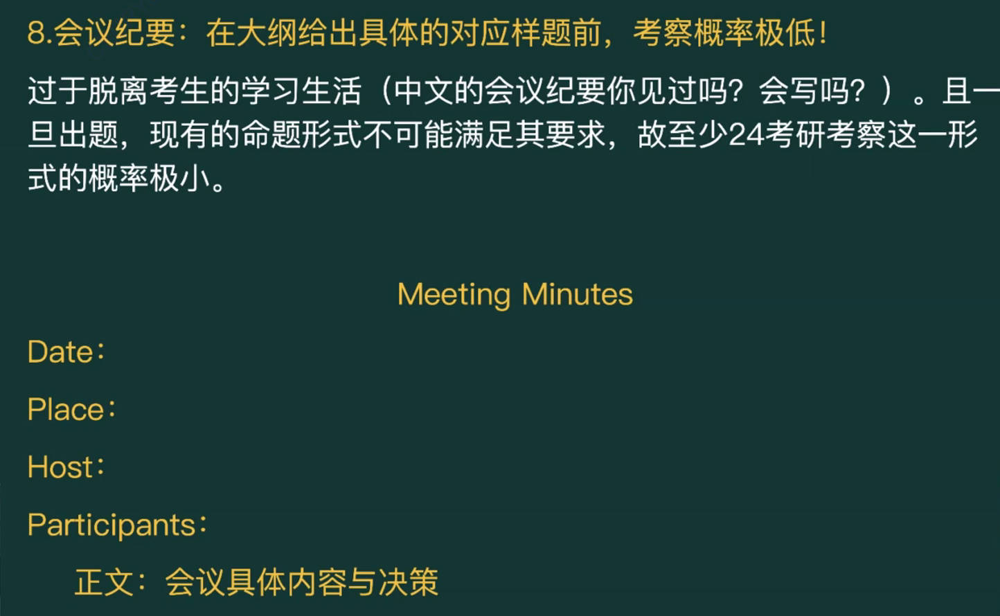

