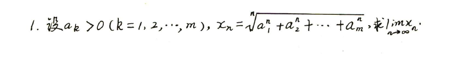
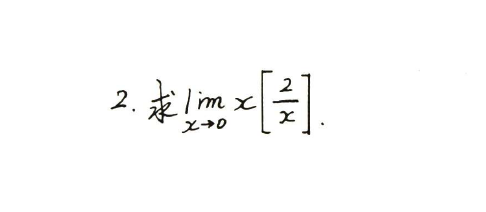
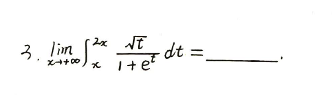
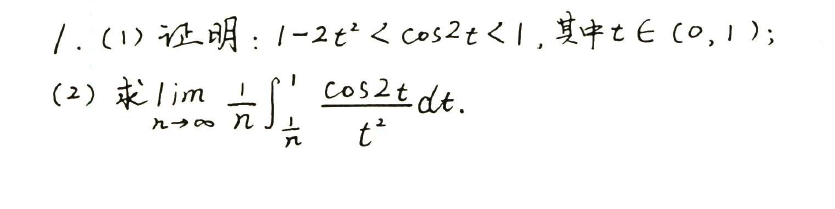
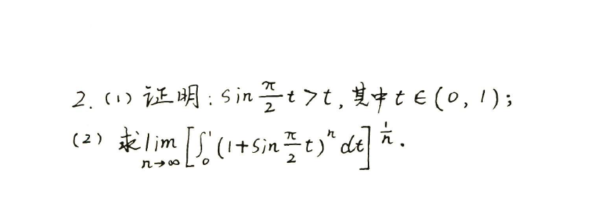
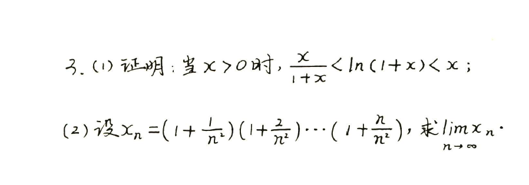

# 139高数错题记录

## 第一章 极限

### 考法1 求7种未定式的常识

| 错题                                                | 错因                                                         |
| --------------------------------------------------- | :----------------------------------------------------------- |
| [`A组 2(1)`](./pic/Question_139高数_1.1_A_2(1).png) | 三角函数诱导公式                                             |
| [`A组 2(2)`](./pic/Question_139高数_1.1_A_2(2).png) | 三角函数诱导公式                                             |
| [`B组 1(2)`](./pic/Question_139高数_1.1_B_1(2).png) | $x\Rightarrow 0$与$x \Rightarrow \infty$是不一样的两种情况，想当然尔了 |
| [`B组 1(3)`](./pic/Question_139高数_1.1_B_1(3).png) | ${a}^{x}$的麦克劳林式不记得了                                |
| [`B组 1(5)`](./pic/Question_139高数_1.1_B_1(5).png) | 没思路                                                       |
| [`B组 1(6)`](./pic/Question_139高数_1.1_B_1(6).png) | 没思路                                                       |

??? question "错题"

    `A组 2(1)` .png) 
    `A组 2(2)` .png) 
    `B组 1(2)` .png) 
    `B组 1(3)` .png) 
    `B组 1(5)` .png) 
    `B组 1(6)` .png) 

??? note "知识点"

    $A组\ 2(1)\Rightarrow\cot(α+\frac{\pi}{2})=-\tan α$ 
    $A组\ 2(2)\Rightarrow\tan(α+\frac{\pi}{2})=-\cot α$ 
    $B组\ 1(3)\Rightarrow a^x = 1+ x\ln{a} + \frac{1}{2}{(x\ln{a})}^2 + \frac{1}{6}{(x\ln{a})}^3 + o(x^3) = \sum\limits_{n=0}^{\infty}\frac{{(x\ln{a})}^n}{n!}$

### 考法2 利用等价无穷小代换求极限

| 错题       | 错因 |
| :--------- | ---- |
| [`A组 1(2)`](./pic/Question_139高数_1.2_A_1(2).png) | $1-\cos x$的展开式搞错了 |
| [`A组 1(3)`](./pic/Question_139高数_1.2_A_1(3).png) | 想节省步骤，然后粗心搞错了正负号 |
| [`A组 1(4)`](./pic/Question_139高数_1.2_A_1(4).png) | 方法错误 |
|[`A组 1(6)`](./pic/Question_139高数_1.2_A_1(6).png)|去括号过程中正负号搞错|
|[`A组 1(9)`](./pic/Question_139高数_1.2_A_1(9).png)|有疑问，未解决|
|[`A组 1(10)`](./pic/Question_139高数_1.2_A_1(10).png)|往下抄式子，少写一个负号|
|[`B组 1(1)`](./pic/Question_139高数_1.2_B_1(1).png)|和`A组（9）`一样的问题|
|[`B组 1(2)`](./pic/Question_139高数_1.2_B_1(2).png)|和`A组 1(4)`一样|
|[`B组 1(4)`](./pic/Question_139高数_1.2_B_1(4).png)|方法错了，解不出来|

??? question "错题"

    `A组 1(2)` .png) 
    `A组 1(3)` .png) 
    `A组 1(4)` .png) 
    `A组 1(6)` .png) 
    `A组 1(9)` .png) 
    `A组 1(10)` .png) 
    `B组 1(1)` .png) 
    `B组 1(2)` .png) 
    `B组 1(4)` .png) 
    `B组 1(5)` .png) 
    `B组 1(7)` .png) 

??? note "知识点"

    $A组\ 1(2) \Rightarrow \cos x = 1 - \frac{1}{2}x^2 + \frac{1}{24}x^4 + o(x^4) = \sum\limits_{n=0}^{\infty}(-1)^{n}\frac{x^{2n}}{(2n)!}$

### 考法3 利用泰勒公式求极限

| 错题                                                | 错因                                                |
| --------------------------------------------------- | --------------------------------------------------- |
| [`A组 1(2)`](./pic/Question_139高数_1.3_A_1(2).png) | 算错                                                |
| [`A组 2`](./pic/Question_139高数_1.3_A_2.png)       | 对带拉格朗日型余项的泰勒公式不熟悉                  |
| [`A组 4(1)`](./pic/Question_139高数_1.3_A_4(1).png) | 提括号，把正负号搞错                                |
| [`A组 5(1)`](./pic/Question_139高数_1.3_A_5(1).png) | 展开不够彻底                                        |
| [`A组 5(4)`](./pic/Question_139高数_1.3_A_5(4).png) | 展开不够彻底                                        |
| [`A组 5(5)`](./pic/Question_139高数_1.3_A_5(5).png) | 方法选难了，泰勒展开漏了一项                        |
| [`A组 6(2)`](./pic/Question_139高数_1.3_A_6(2).png) | 纯粗心了，当$x \rightarrow 0$，把$\sin{x}$记作$1$了 |
| [`A组 6(3)`](./pic/Question_139高数_1.3_A_6(3).png) | 通分把分子正负搞错了                                |
| [`A组 7(2)`](./pic/Question_139高数_1.3_A_7(2).png) | 觉得$x \rightarrow 0，\cos{x}=1$，就没展开$\cos{x}$ |

??? question "错题"

    `A组 1(2)` .png) 
    `A组 2`  
    `A组 4(1)` .png) 
    `A组 5(1)` .png) 
    `A组 5(4)` .png) 
    `A组 5(5)` .png) 
    `A组 6(2)` .png) 
    `A组 6(3)` .png) 
    `A组 7(2)` .png) 

### 考法4 洛必达法则

| 错题                                                | 错因         |
| --------------------------------------------------- | ------------ |
| [`B组 2(2)`](./pic/Question_139高数_1.4_B_2(2).png) | 正负号搞错了 |

??? question "错题"

    `B组 2(2)` .png) 

### 考法5 幂指函数求极限

| 错题       | 错因 |
| ---------- | ---- |
| [`A组 1(5)`](./pic/Question_139高数_1.5_A_1(5).png) |      |
|[`A组 1(7)`](./pic/Question_139高数_1.5_A_1(7).png)||
|[`B组 1(2)`](./pic/Question_139高数_1.5_B_1.png)||
|[`B组 4`](./pic/Question_139高数_1.5_B_4.png)||
|[`B组 7`](./pic/Question_139高数_1.5_B_7.png)||
|[`B组 8`](./pic/Question_139高数_1.5_B_8.png)||

??? question "错题"

    `A组 1(5)` .png) 
    `A组 1(7)` .png) 
    `B组 1`  
    `B组 4`  
    `B组 7`  
    `B组 8`  

### 考法6 利用中值定理求极限

??? note "知识点"

    拉格朗日中值定理$\Rightarrow$
    柯西中值定理$\Rightarrow$

### 考法7 无穷小阶的比较或确定

| 错题       | 错因 |
| ---------- | ---- |
| `A组 7`    |      |
| `A组 8`    |      |
| `B组 1`    |      |
| `B组 4`    |      |
| `B组 5(3)` |      |
| `B组 8`    |      |

??? question "错题"

    `A组 7`  
    `A组 8`  
    `B组 1`  
    `B组 4`  
    `B组 5(3)` .png) 
    `B组 8`  

### 考法8 已知极限反求参数

| 错题                                            | 错因                                                         |
| ----------------------------------------------- | ------------------------------------------------------------ |
| [`B组 1`](./pic/Question_139高数_1.8_B_1.png)   | 麦克劳林公式的适用条件搞错了，$\sqrt{1+{\Box}}$，想用泰勒展开，$\Box$必须$=0$ |
| [`B组 4`](./pic/Question_139高数_1.8_B_4.png)   | 没思路                                                       |
| [`B组 5`](./pic/Question_139高数_1.8_B_5.png)   | 计算错误                                                     |
| [`B组 7`](./pic/Question_139高数_1.8_B_7.png)   | 变限积分不熟悉                                               |
| [`B组 10`](./pic/Question_139高数_1.8_B_10.png) | 定积分的计算不熟练                                           |
| [`B组 12`](./pic/Question_139高数_1.8_B_12.png) |                                                              |

??? question "错题"

    `B组 1`  
    `B组 4`  
    `B组 5`  
    `B组 7`  
    `B组 10`  
    `B组 12`  

### 考法9 利用夹逼准则求极限

| 错题                                          | 错因 |
| --------------------------------------------- | ---- |
| [`A组 1`](./pic/Question_139高数_1.9_A_1.png) |      |
| [`A组 2`](./pic/Question_139高数_1.9_A_2.png) |      |
| [`A组 3`](./pic/Question_139高数_1.9_A_3.png) |      |
| [`B组 1`](./pic/Question_139高数_1.9_B_1.png) |      |
| [`B组 2`](./pic/Question_139高数_1.9_B_2.png) |      |
| [`B组 3`](./pic/Question_139高数_1.9_B_3.png) |      |

??? question "错题"

    `A组 1` 
    `A组 2`  
    `A组 3`  
    `B组 1`  
    `B组 2`  
    `B组 3` 

### 考法10 利用定积分定义求极限

| 错题                                           | 错因           |
| ---------------------------------------------- | -------------- |
| [`A组 4`](./pic/Question_139高数_1.10_A_4.png) | 积分公式没记熟 |
| [`A组 6`](./pic/Question_139高数_1.10_A_6.png) | 定积分算错了   |
| [`A组 7`](./pic/Question_139高数_1.10_A_7.png) | 没思路         |
| [`A组 8`](./pic/Question_139高数_1.10_A_8.png) | 定积分算错了   |
| [`B组 3`](./pic/Question_139高数_1.10_B_3.png) | 没思路         |
| [`B组 6`](./pic/Question_139高数_1.10_B_6.png) | 没思路         |

??? question "错题"

    `A4`  
    `A6`  
    `A7`  
    `A8`  
    `B3`  
    `B6` 

??? note "知识点"

    $\int_{a}^{b}f(x)=\lim\limits_{x\to∞}\sum_{i=1}^{n}f(a+\frac{b-a}{n}i)\frac{b-a}{n}$，当$a=0,b=1$时，有$\int_{0}^{1}f(x){\mathrm{d} x}=\lim\limits_{0\to\infty}f(\frac{i}{n})\frac{1}{n}=\lim\limits_{0\to\infty}{\frac{1}{n}}[f(\frac{1}{n})+f(\frac{2}{n})+{\ldots}+f(\frac{n}{n})]$

### 考法11 证明数列极限存在

> 太难了，后面进行专题复习

### 考法12 极限的定义与性质

| 错题                                           | 错因 |
| ---------------------------------------------- | ---- |
| [`A组 1`](./pic/Question_139高数_1.12_A_1.png) |      |
| [`A组 2`](./pic/Question_139高数_1.12_A_2.png) |      |
| [`B组 1`](./pic/Question_139高数_1.12_B_1.png) |      |
| [`B组 2`](./pic/Question_139高数_1.12_B_2.png) |      |

??? question "错题"

    `A1`  
    `A2`  
    `B1`  
    `B2`  

### 考法13 间断点的分类

| 错题                                           | 错因                                   |
| ---------------------------------------------- | -------------------------------------- |
| [`A组 4`](./pic/Question_139高数_1.13_A_4.png) | 漏了间断点                             |
| [`A组 5`](./pic/Question_139高数_1.13_A_5.png) | 漏了间断点                             |
| [`B组 1`](./pic/Question_139高数_1.13_B_1.png) | 计算错误                               |
| [`B组 2`](./pic/Question_139高数_1.13_B_2.png) | 计算错误                               |
| [`B组 4`](./pic/Question_139高数_1.13_B_4.png) | 对于取整函数的间断点要考虑每个整数位置 |
| [`B组 7`](./pic/Question_139高数_1.13_B_7.png) | 概念题                                 |

???question "错题"

    `A组 4`  
    `A组 5`  
    `B组 1`  
    `B组 2`  
    `B组 4`  
    `B组 7`  

## 第二章 一元函数微分学

### 考法1 导数定义的充分性分析

> 没题，之后补充知识点

### 考法2 一元函数导数的基本性质

| 错题                                          | 错因                                                         |
| --------------------------------------------- | ------------------------------------------------------------ |
| [`A组 1`](./pic/Question_139高数_2.2_A_1.png) | $c$选项中，n默认是自然数，所以$n\rightarrow \infty$默认是$+\infty$ |
| [`A组 4`](./pic/Question_139高数_2.2_A_4.png) | 把结论整理一下，记一记                                       |
| [`B组 1`](./pic/Question_139高数_2.2_B_1.png) | $(1)\ f'(x_0)存在与 \lim\limits_{x \to {x_0}}f(x)存在并不等价$ $(2)$连续的概念没搞明白 $(3)$对绝对值函数的分析，不熟练 |

??? question "错题"

    `A组 1`  
    `A组 4`  
    `B组 1`  

### 考法3 利用导数定义求导数

| 错题                                                | 错因                                                         |
| --------------------------------------------------- | ------------------------------------------------------------ |
| [`B组 1(1)`](./pic/Question_139高数_2.3_B_1(1).png) | 多项式相除$\frac{x^{2023}-1}{x-1}=$                          |
| [`B组 2`](./pic/Question_139高数_2.3_B_2.png)       | 极限求解$\lim\limits_{x \to 1}\frac{\tan{\frac{\pi x}{4}}-1}{x-1}=$ |
| [`B组 4`](./pic/Question_139高数_2.3_B_4.png)       | 没思路                                                       |

??? question "错题"

    `B组 1(1)` .png) 
    `B组 2`  
    `B组 4`  

### 考法4 与导数有关的极限

| 错题                                          | 错因                     |
| --------------------------------------------- | ------------------------ |
| [`A组 3`](./pic/Question_139高数_2.4_A_3.png) | 没搞清谁才是实际变量     |
| [`B组 1`](./pic/Question_139高数_2.4_B_1.png) | 想当然而了，计算过程偷懒 |
| [`B组 7`](./pic/Question_139高数_2.4_B_7.png) | 思路错误                 |
| [`B组 8`](./pic/Question_139高数_2.4_B_8.png) | 不会                     |

??? question "错题"

    `A组 3`  
    `B组 1`  
    `B组 7`  
    `B组 8`  

### 考法5 复合函数、隐函数、参数方程、反函数求导

| 错题                                                  | 错因 |
| ----------------------------------------------------- | ---- |
| [`A组 1(17)`](./pic/Question_139高数_2.5_A_1(17).png) |      |
| [`A组 1(22)`](./pic/Question_139高数_2.5_A_1(22).png) |      |
| [`A组 3(4)`](./pic/Question_139高数_2.5_A_3(4).png)   |      |
| [`A组 5(1)`](./pic/Question_139高数_2.5_A_5(1).png)   |      |
| [`A组 6(3)`](./pic/Question_139高数_2.5_A_6(3).png)   |      |
| [`A组 7`](./pic/Question_139高数_2.5_A_7.png)         |      |
| [`B组 2`](./pic/Question_139高数_2.5_B_2.png)         |      |
| [`B组 3`](./pic/Question_139高数_2.5_B_3.png)         |      |
| [`B组 5`](./pic/Question_139高数_2.5_B_5.png)         |      |
| [`B组 7`](./pic/Question_139高数_2.5_B_7.png)         |      |
| [`B组 11`](./pic/Question_139高数_2.5_B_11.png)       |      |
| [`B组 12`](./pic/Question_139高数_2.5_B_12.png)       |      |
| [`B组 13`](./pic/Question_139高数_2.5_B_13.png)       |      |
| [`B组 14`](./pic/Question_139高数_2.5_B_14.png)       |      |

??? question "错题"

    `A组 1(17)` .png) 
    `A组 1(22)` .png) 
    `A组 3(4)` .png) 
    `A组 5(1)` .png) 
    `A组 6(3)` .png) 
    `A组 7`  
    `B组 2`  
    `B组 3`  
    `B组 5`  
    `B组 7`  
    `B组 11`  
    `B组 12`  
    `B组 13`  
    `B组 14`  

### 考法6  连续与可导之间的关系

| 错题                                          | 错因 |
| --------------------------------------------- | ---- |
| [`B组 3`](./pic/Question_139高数_2.6_B_3.png) |      |
| [`B组 4`](./pic/Question_139高数_2.6_B_4.png) |      |

??? question "错题"

    `B组 3`  
    `B组 4`  

### 考法7 分段函数求导

| 错题                                                | 错因 |
| --------------------------------------------------- | ---- |
| [`A组 2(2)`](./pic/Question_139高数_2.7_A_2(2).png) |      |
| [`A组 5`](./pic/Question_139高数_2.7_A_5.png)       |      |
| [`B组 1`](./pic/Question_139高数_2.7_B_1.png)       |      |
| [`B组 2`](./pic/Question_139高数_2.7_B_2.png)       |      |
| [`B组 3`](./pic/Question_139高数_2.7_B_3.png)       |      |
| [`B组 4`](./pic/Question_139高数_2.7_B_4.png)       |      |
| [`B组 5`](./pic/Question_139高数_2.7_B_5.png)       |      |
| [`B组 7`](./pic/Question_139高数_2.7_B_7.png)       |      |

??? question "错题"

    `A组 2(2)` .png) 
    `A组 5`  
    `B组 1`  
    `B组 2`  
    `B组 3`  
    `B组 4`  
    `B组 5`  
    `B组 7`  

### 考法8 高阶导数的求法

| 错题                                            | 错因                   |
| ----------------------------------------------- | ---------------------- |
| [`A组 1`](./pic/Question_139高数_2.8_A_1.png)   | 计算错误               |
| [`A组 3`](./pic/Question_139高数_2.8_A_3.png)   | 方法错误               |
| [`B组 1`](./pic/Question_139高数_2.8_B_1.png)   | 没思路                 |
| [`B组 3`](./pic/Question_139高数_2.8_B_3.png)   | 计算错误               |
| [`B组 4`](./pic/Question_139高数_2.8_B_4.png)   | 没思路                 |
| [`B组 5`](./pic/Question_139高数_2.8_B_5.png)   | $\arctan{x}的泰勒展开$ |
| [`B组 6`](./pic/Question_139高数_2.8_B_6.png)   | 没思路                 |
| [`B组 7`](./pic/Question_139高数_2.8_B_7.png)   | 计算错误               |
| [`B组 9`](./pic/Question_139高数_2.8_B_9.png)   | 没思路                 |
| [`B组 10`](./pic/Question_139高数_2.8_B_10.png) | 算错了                 |

??? question "错题"

    `A组 1`  
    `A组 3`  
    `B组 1`  
    `B组 3`  
    `B组 4`  
    `B组 5`  
    `B组 6`  
    `B组 7`  
    `B组 9`  
    `B组 10`  

### 考法9 求渐近线

| 错题                                                | 错因               |
| --------------------------------------------------- | ------------------ |
| [`A组 3`](./pic/Question_139高数_2.9_A_3.png)       | 计算错误           |
| [`A组 5`](./pic/Question_139高数_2.9_A_5.png)       | 漏了一条铅直渐近线 |
| [`B组 1`](./pic/Question_139高数_2.9_B_1.png)       | 极限计算           |
| [`B组 2`](./pic/Question_139高数_2.9_B_2.png)       | 漏了一条水平渐近线 |
| [`B组 3(2)`](./pic/Question_139高数_2.9_B_3(2).png) | 参数方程知识点     |
| [`B组 4`](./pic/Question_139高数_2.9_B_4.png)       | 极限计算错误       |

??? question "错题"

    `A组 3`  
    `A组 5`  
    `B组 1`  
    `B组 2`  
    `B组 3(2)` .png) 
    `B组 4`  

---

## 专题训练—概念题

