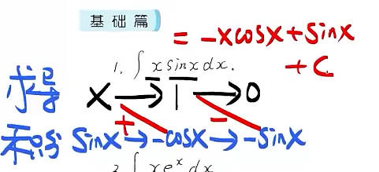

# 三大计算

## 第一章：求极限

### 1.1 求极限入门

#### 错题

- 基础篇：1、3、11、15、17

- 强化篇：6、9、11、12、13、14

- 真题自测： 2000年

#### 知识点

1. 三角函数cot(x)、sec(x)、csc(x)、arctan(x)、arccot(x)、arcsin(x)、arccos(x)、sec(x)、csc(x)

2. 因式分解

3. 洛必达法则的使用条件

4. 高阶无穷小

### 1.2利用泰勒公式求极限

#### 错题

- 基础篇：3、4、7、10、11、15、16、17、18

- 强化篇：2、3、5、6、8、10、12、13、14、15、16、17、18、19、23

- 真题自测：3（1999年）、4（2000年）、9（2004年）、10（2007年）

```latex
基础篇：
3. 乘除法直接等价无穷小代换，不需要泰勒展开
4. 方法不对，cotx应该直接变1/tanx
7. 方法错了，当时完全不会
10. cotx直接变1/tanx
11. 简单计算出错，正负号
15. 计算出错，正负号
16. 计算出错，正负号
17. 相乘时的泰勒展开，寻找对应的最高次幂的系数
18. 时的泰勒展开，寻找对应的最高次幂的系数
强化篇：
2 .相乘时的泰勒展开，寻找对应的最高次幂的系数
3. 函数的泰勒展开，寻找对应的最高次幂的系数
5. 相乘时的泰勒展开，寻找对应的最高次幂的系数
6. 法直接等价无穷小代换，不需要泰勒展开
8. 函数的泰勒展开，寻找同次幂的系数
10. 函数的泰勒展开，寻找对应的最高次幂的系数
12. 函数的泰勒展开，寻找对应的最高次幂的系数
13. 完全错的，并且题还看错了
14. 函数的泰勒展开，寻找对应的最高次幂的系数
15. 不明白，思路不对
16. 计算出错（化简，符号错了）| 复合函数的泰勒展开，寻找对应的最高次幂的系
17. 不会做
18. 函数的泰勒展开，寻找对应的最高次幂的系数
19. 复合函数的泰勒展开，寻找对应的最高次幂的系数
23. 简单计算出错，多加了一个平方
真题自测：
3(1999). 方法用难了|泰勒公式记混了
4(2000). 简单计算出错，除法算错了
9(2004). 简单计算出错，通分错了
10(2007). 泰勒公式记错了
```

#### 知识点

  - 泰勒展开式

  - 复合函数的泰勒展开，寻找分子分母对应的最高次幂


### 1.3 利用等价无穷小求极限

#### 错题&错因

- 基础篇：3、9、11、145、15、21、22

- 强化篇：2、14、15、16、19、20、25、26、27、29、31、34、36、40、41、43、44

- 真题自测：6（1995）、10（2009）

```latex
基础篇：
3. 低阶+高阶~低阶
9. 公式记错了
11. 计算错误
14. 公式记错
18. 公式记错了
21. 题抄错了
22. 计算错误
强化篇：
2. 三角函数公式没记住
14. 没做错，不过有更好的方法
15. 不会做，三角函数部分差的有点多
16. 计算错误→正负号问题
19. 要找对应的高次
20. 公式记错误
25. 计算错误→正负号问题
26. 没做错，但方法可以改进
27. 低阶+高阶，保留低阶
29. 公式记错了/有理化的方法会更简单
31. 完全没思路
34. 一些额外的泰勒展开公式		
36. 要及时把非0因子化简出来
40. 公式记错了
41. 等价无穷小的适用条件没记
43. 完全没思路
44. 完全没思路
真题自测：
6(1995). 计算错误→正负号
10(2009). 一个题目不会通篇只用一个方法
```

>强化篇34提到的函数如下：


$$
\ln\left(x + \left(1 + x^2\right)^{\frac{1}{2}}\right)
$$

#### 知识点

- 等价无穷小的适用条件

- 泰勒展开式

- 三角函数的公式

#### 推荐做的题

- 强化篇：1、3、7、14、15、16、21、22、25、26、27、29、30、30、31、33、**34**、35、37、39、40、41、42、43、44


### 1.4 利用洛必达法则求极限

> 我洛必达部分好垃圾啊，做的我压力大

#### 错题&错因：

- 基础篇：2、4、5、6、14、18、24、

- 真题自测：6(1992)、7(1992)、9(1988)

``````latex

基础篇：

2. 不一定非要用洛必达，强行用反而会更麻烦;

4. 用洛必达之前化简

5. 做题之前，先判断是不是未定式

6. 用洛必达之前先化简

14. 三角函数求导<!--test-->

24. 做题之前，先判断是不是未定式

真题自测：

6(1992).三角函数求导&用洛必达之前先化简

7(1992). 简单计算出错，四则运算

9(1988). 思路完全错误

``````

#### 知识点

- 用洛必达法则的条件是什么

- 如何用

- 什么函数不能用

### 1.5幂指函数求极限

#### 错题&错因

- 基础篇：17、19、20、21、25

- 强化篇：1、2、3、5、6、12、16、17、20、22、26、27、28、30

- 真题自测：2(1989)、5(1990)、11(1988)、12(1989)、14(1987)

```latex
基础篇：
17. 化简过程中，从上到下把式子抄错了
19. 化简过程中，从上到下把符号抄错了
20. 对数函数的四则运算
21. 题抄错了
25. 口算算错了
强化篇：
1. 看清楚谁才是变量，别下意识把x当变量
2. 把答案化简到最简
3. 化简出错&&等价无穷小的适用条件
5. 等价无穷小的适用条件&&对数函数+三角函数的变换（后面这点刚开始想不到）
6. 过程错了，等价无穷小的适用条件(待定)
12. 等价无穷小的适用条件
16. 没有思路的时候，试试变形
17. 化简过程中，从上到下把式子抄错了
20. 三角函数求导
22. 化简过程中，从上到下多抄了一部分
26. 辅助角公式
27. 思路有问题&&对数函数的性质
28. 化简过程中，从上到下把式子抄错了
30. 指数函数的性质 
真题自测：
2(1989). 简单计算出错
5(1990). 化简过程中，从上到下把式子抄错了
11(1988). 等价无穷小的适用条件
12(1989). 不懂
14(1987). 简单四则运算出错
```

> $a^{x^2}\ne a^x\times a^x$

#### 知识点

- 重要公式：

><font color = red>$\lim\limits_{x\to∞}（\dfrac{ax+b}{ax+c})^{hx+k}=e^\frac{(b-c)h}{a}$</font>

- 等价无穷小的适用条件

#### 推荐多做的题

- 基础篇：

  - 13、15、16、14、18、19、20、21、23、24、25


### 1.6极限的应用之一：连续与间断点

> 纯纯没脑子啊，基本上全错了

#### 错题&错因

- 基础篇：1(1)、1(2)、1(5)、1(6)、2、3

- 强化篇：1 、2

- 真题自测：1(2009)、2(1998)

```latex
基础篇：
1（1）. 等价无穷小或者洛必达之前，先确定是不是未定式 
1（2）. 间断点找不全
1（5）.指数函数要考虑正负
1（6）.右极限存在且相等除了可能是可去间断点以外，还可能是连续点
2. 找不全间断点&&指数函数要考虑正负
强化篇：
1. 答案对，但过程有错
2. 水平还不够，别口算了
真题自测：
1（2009). 三角函数的间断点找全
2(1998). 三角函数的间断点找全
```

#### 知识点

- 间断点的来源：

  - <font color =red>分母等于0的点</font>

  - <font color =red>函数无意义的点</font>

- 对于三角函数的间断点：

  1. 根据周期先写出所有的间断点

  2. 再判断是不是题中需要的点


### 1.7极限的应用之二：求渐近线

#### 错题&错因

- 基础篇：1、4

- 强化篇：1、2

```latex
基础篇：
1. 刚开始不会做
4. 口算错误
强化篇：
1. 水平渐近线的求法没搞明白&&不仅要考虑正无穷，还要考虑负无穷
2. 等价无穷小的适用条件&&从根号里面往外提x时，既要考虑正，也要考虑负
```

#### 知识点

- 求渐近线:

    1. 先垂直，分母为0，$\lim\limits_{x\to x_0}f(x)=∞$

    2. 再水平，$\lim\limits_{x\to∞}f(x)=A$

    3. 最后斜渐近线，$k=\lim\limits_{x\to∞}\dfrac{f(x)}{x}$，$b=\lim\limits_{x\to∞}[f(x)-kx]$

> <font color =red>在函数同一侧，2、3只存在一种</font>

- 泰勒公式补充：

  - $\dfrac{1}{1+x}=1-x+x^2-x^3+...+(-1)^nx^n$，$\left | x\right |<1$

  - $\dfrac{1}{1-x}=1+x+x^2+x^3+...+x^n$，$\left | x\right |<1$


## 第二章：求导数

### 2.1：利用导数定义求导数

#### 错题&错因&改进办法

- 基础篇：1、5

- 真题自测：2、3、5、6

```
基础篇：
1： 口算出错→别口算了
5: 有点懵，不敢下手→动笔写就成
真题自测：
2. 判断连续性还有点懵
3. 没思路
5. 积分上限函数的相关概念不了解
6： 求极限问题→求极限过程中，不能直接带值
```

#### 知识点

- 应用场景

  - 被求导的函数过于复杂

  - 分段函数的分段点求导

  - 含有抽象函数

  - 不符合求导法则

- 分段函数：

  - 分段区间用导数法则

  - 分数点用导数定义

- 连续性：

  - $\lim\limits_{x\to0}f'(x)=f'(0)\rightarrow$导数在零点连续


### 2.2利用导数定义求极限

#### 错题&错因&解决办法

- 基础篇：3

- 强化篇：2、7、8、9

- 真题自测：3、5

```latex
基础篇：
3： 化简问题→化简化到最简
强化篇：
2： 不会→在未知中构建已知的部分
7： 定义没搞明白&&自变量没搞清楚
8： 做到一半不会了→在已有的关系式中凑出要求的式子
9： 题抄错了
真题自测：
3： 三角函数、复合函数求导
5： 分数的求导公式
```

#### 推荐多做的题

- 基础篇：2

- 强化篇：1、2、3、6、7、8、9、10

#### 知识点

- 函数某一点的导数存在$\rightarrow$不能洛必达

- 二阶导数：

  - $f(x)$是二阶连续导数$\rightarrow$对$f(x)$求导，求两次

  - $f(x)$二阶可导$\rightarrow$对$f(x)$求导，只能求一次


### 2.3复合函数求导

#### 错题&错因&解决办法

- 基础篇：9、10、17、19

- 强化篇：1、3、9、13、15

- 真题自测：5(1993)、12(2012)、

```latex
基础篇：
9: 三角函数化简
10: 三角函数化简
17: 中间变量才对自变量求导⇒搞清楚中间变量和自变量
19: 正负符号错了
强化篇：
1: 三角函数公式⇒两角之和/两角之差
3: 从上到下，抄错了
9: 可能化简错了
13: 幂指函数求导求错了
15: 算错了，完全平方公式不会了
真题自测：
5(1993): 求导之后还把原本的式子照抄下来了
12(2012): 求导求错了
```

#### 知识点

- 基础篇9、10用到的：

  - $\tan^2x+1=\sec^2x$

  - $\cot^2x+1=\csc^2x$

- $\int\frac{\mathrm{d}x}{x\ln x\ln (\ln x)}=\ln (\ln(\ln x))+C$

#### 推荐多做的题

- 基础篇：3~15， 16~19没必要


### 2.4 隐函数求导

#### 错题&错因&解决方法

- 基础篇：10

- 强化篇：4、6

- 真题自测：1、8

```latex
基础篇：
10：三角函数化简&求导求错了
强化篇：
4：切线方程的点带错了
6：移项的时候，符号弄错了
真题自测：
1：求导求错了，不知道为啥把×写+了
8：求导，算错了
```

#### 知识点

- 若求$\frac{\mathrm{d} y}{\mathrm{d} x}$,三种方法：

  - 直接法：两边同时求导

  - 公式法：求偏导：$\frac{\mathrm{d} y}{\mathrm{d} x}=-\frac{F_x^{'}(x,y)}{F^{'}_y(x,y)}$，对x求偏导不用管y,对y求偏导，不用管x

  - 微分法：利用一阶微分形式不变的性质分别对x和y求导，再通过移项求得的值

- 椭圆切线方程：$\frac{xx_0}{a^2}+\frac{yy_0}{b^2}=1$


### 2.5参数方程求导

#### 错题&错因&解决方法

- 基础篇：1、4、8

- 强化篇：1、2、4、6

- 真题自测：4(1996)、6(2003)、7(2010)、12(2021)

```latex
基础篇：
1. 三角函数求导
4. 化简需要化到最简
8. 隐函数求导&y'与y'(t)分不清
强化篇：
1. dy/dx与dy/dt分不清
2. 三角函数化简
4. 极坐标方程
6. 复合函数求导
真题自测：
4(1996). dx/dt多求了一次导
6(2003). 约分约错了
7(2010). 少抄一个负号
12(2021). 求导少求一项
```

#### 知识点

- 极坐标与直角坐标的关系：

  - $x=rcos\theta$

  - $y=rsin\theta$

### 2.6分段函数求导

#### 错题&错因

- 强化篇：2、 4、5、6、7

```latex
强化篇：
2. 洛必达适用条件&一阶连续导数所代表的信息
4. 分数的求导算错
5. 一阶连续导数所代表的信息
6. 第一次做的时候，不会，没思路
7. 复合函数求导
```

#### 知识点

- 看到绝对值函数$\Longrightarrow$不可导点的个数

  - $y = \left | x \right |$在$x=0$处连续但不可导，但$y=x\left | x \right |$在$x = 0$处可导

  - $y = \left | x-a \right |$在$x=a$处连续但不可导，但$y=(x-a)\left | x-a \right |$在$x = a$处可导

  - 举例：$y= x \left |x(x-2)\right | \Longrightarrow$函数在$x = 0$处可导，在$x = 2$处连续

- $$
  \begin{equation}  
  y=
  \begin{cases}
  x^\alpha sin\frac{1}{x^\beta}&\mbox{$x\ne 0$}\\ 
  0 &\mbox{$x = 0$}
  \end{cases} 
  \end{equation}
  $$
  
  
  
  - $\alpha>0$，$f(x)$在$x=0$处连续；
  
  - $\alpha>1$，$f(x)$在$x =0$处可导；
  
  - $\alpha > \beta+1$，$f'(x)$在$x = 0$连续；
  
- $f(x)$存在$\Longrightarrow f(x)$连续$\Longrightarrow f(x)$可导$\Longrightarrow f'(x)$连续$\Longrightarrow f^{''}(x)$存在$\Longrightarrow f^{''}(x)$连续，从左到右，满足后面一定满足前面，满足前面不一定满足后面

- $\lim\limits_{x \to 0} \frac{f(x)}{x}=A \Longrightarrow f(0)=0 , f'(0)=A$


### 2.7变限积分函数求导

#### 错题&错因&解决方法

- 基础篇：2、5
- 强化篇：2、3、6、9
- 真题自测：1(1987)、3(1998)、9(1999)

```latex
基础篇：
2. 带错了
5. 写着写着把\dt丢了
强化篇：
2. 求极限，非0因子先化简
3. 代入时，x,y搞反了
6. 蒙对的，重新写一下
9. 微分计算算错了
真题自测：
1(1987). 思路错了
3(1998). 有一部分不会
9(1999). 题抄错了
```

#### 知识点

- 碰到$f'(x)\ne0\Longrightarrow$用到导数的定义求导数

- 拐点：

  1. $f^{''}(x_0)=0$

  2. 两种方法：

     (1) 看$x=x_0$左右两端，$f^{''}(x)$是否异号

     - $f^{''}(x)>0$,凹函数
     - $f^{''}(x)<0$,凸函数

     (2) $f^{'''}(x_0)\ne0$

- $\int_{0}^{x}f(t)dt\Longrightarrow$x的m阶无穷小，则$(\int_{0}^{x}f(t)dt)'=f(x)\Longrightarrow$x的(m-1)阶无穷小

- $\alpha x-sin\beta x$

  - $\alpha = \beta$,x的3阶无穷小
  - $\alpha \ne \beta$,x的1阶无穷小

- $\int_{0}^{g(x)}f(t)dt$,当$x\rightarrow0$,$f(x)$为$x$的$m$阶无穷小，$g(x)$ 为$x$的$（m-1）$阶无穷小$\Longrightarrow$$\int_{0}^{g(x)}f(t)dt$为$x$的$(m+1)n$阶无穷小

#### 推荐多做的题

- 强化篇：5、6、7、9
- 真题自测：1(1987)、2(1993)、3(1998)、4(2004)


### 2.8 高阶导数

#### 错题&错因&解决方法

- 基础篇：1、2、4、6
- 强化篇：1、3、4、5

```latex
基础篇：
1. 公式没记数
2. 先分解因子，再套公式
4. 没思路
6. \arctanx的泰勒通项&n分为奇偶
强化篇：
1.  归纳法没学好
3.  \frac{1}{1+x}泰勒通项
4.  \sinx的泰勒通项&n分为奇偶
5. \ln(1+x)的泰勒通项&n分为奇偶
```

#### 知识点

- 归纳法的一些公式：
    - $(e^{ax+b})^{(n)}= a^ne^{ax+b}$
    - $[sin(ax+b)]^{n}= a^n sin(ax+b+\frac{\pi}{2}\times n)$
    - $[cos(ax+b)]^{n}= a^n cos(ax+b+\frac{\pi}{2}\times n)$
    - $(\frac{1}{ax+b})^{n}=\frac{(-1)^n a_n n!}{(ax+b)^n}$
    - $[\ln(ax+b)]^{(n)}=\frac{(-1)^{n-1} a^n (n-1)!}{(ax+b)^n}$
    - $[f(x) \pm g(x) ]^{(n)}=f^{(n)}(x) \pm g^{(n)}(x)$


##  第三章 求积分

###  3.1最简单的求积分

#### 错题

- 基础篇：3、14、15、22
- 强化篇：8、11、17、20、24、26、28、29、30、33、34、37、39
- 真题自测：

```latex
基础篇：
3. 1/x求原函数时,lnx的x需要加绝对值
14. 分子，分母搞错了
15. 1/x求原函数时,lnx的x需要加绝对值
22. 公式记错了（做公式的卷子，每天一考）
强化篇：
8. 化简错误--细心问题
11. 复合幂函数求导--细心问题
17. 简单计算--细心问题
20. x的负次幂函数求原函数--细心问题
24. 简单计算--细心问题
26. 三角函数，求导的正负号--细心问题
28. 绝对值为分段函数 --- 分段考虑
29. 三角函数没思路 \Longrightarrow  $\sin^2{x} + \cos^2{x} = 1$
30. 三角函数计算错误-- 三角函数公式不熟练
33. 三角函数公式不熟悉 \Longrightarrow  $\tan^2{x} + 1 = \sec^2{x}$
34. 三角函数公式不熟悉 \Longrightarrow  $\cot^2{x} + 1 = \csc^2{x}$
37. 不定积分对于自变量的取值范围
39. 简单计算错误--细心问题
```

#### 知识点

- 把公式好好记一记


###  3.2利用换元法求不定积分

#### 错题

- 基础篇：12、15、20
- 强化篇：10、12、17、20、27、32、36、40、45、47、49、50、51、55、57、59、61、63、65、67、70、72、73、78、86、95、98、106、107
- 真题自测：2（1992）、5（1995）、10（1993）、11（2001）

```latex
基础篇：
12. 积分公式记得不熟
15. 系数忘抄了--细心问题
20. 刚开始做，没思路
强化篇：
10. 新碰到的一类题,记在知识点里面
12. 公式不熟练
17. 第一次见，不会处理
20. 公式不熟练
27. 方法错了
32. 计算错误--计算能力
36. 公式记混了
40. 第一次做的时候没思路
41. 第一次做的时候没思路
45. 新的一类题，记在知识点中
49. 没思路 --- 先进行初等变形，再凑微分
50. 没思路，知识点
51. 系数弄错了
55. 没思路 --- 凑微分（把分子凑成分母的导数）
57. 没思路 --- 先进行初等变形之后，凑微分（把分子凑成分母的导数）
59. 知识点记录
61. 第一次做的时候没思路
63. 碰到三个初等函数相乘，把其中两个结合起来来算
65. 计算能力不够
67. 常数搞错了--细心问题
70. 题抄错了（两道都没做错）
72. 带有三角函数的复合函数求导错误
73. 三角函数公式 --- 积化和差
78.公式没记熟
86. 没思路，知识点记录
95. 方法错误，知识点记录
98. 和第10题类似
106. 第一次，没思路 \Longrightarrow  利用$\sin^2{x} + \cos^2{x} = 1$
107. 没思路 --- 三角换元不够熟练
真题自测：
2（1992）. 前期做，练得不够多，一子下没想法
5（1995）. 把份子凑成分母的导数
10（1993）. 计算能力 --- 需要更细心
11（2001）. 三角函数不够熟练
```

#### 知识点

- 强化10，形如$\int\frac{a\sin{x}+b\cos{x}}{c\sin{x}+d\cos{x}}$，分子、分母是$\sin{x}、\cos{x}$的线性组合

  - 令分子=A×分母+B×分母的导数
  - 则：原式 = $Ax+B\ln\left | \text{分母} \right |+C$

- 强化45，形如$\int\frac{dx}{\sin^m{x}\cos^n{x}}$的题

  - 利用$\sin^2{x} + \cos^2{x} = 1$进行降幂

- 强化50，碰到$x^x$,把它变成$\mathrm{e}^{x\ln{x}}$来做

- 强化59，碰到形如$\int\frac{dx}{(a\sin{x}+b\cos{x})^2}$

  - 分母提$\cos^2{x}$

- 常见中间变量，凑微分用

  - $(\frac{\mathrm{e}^x}{x})^{'} = \frac{\mathrm{e}^x(1+x)}{x^2}$
  - $(x\mathrm{e}^x)^{'} = \mathrm{e}^x(1+x)$
  - $(\frac{\ln{x}}{x})^{'} = \frac{1-\ln
    {x}}{x^2}$
  - $(x\ln{x})^{'} = \ln{x} + 1$

- 强化73，三角函数--积化和差公式

  - 和差化差

    $\sin\alpha + \sin\beta = 2\sin(\frac{\alpha + \beta}{2})\cos(\frac{\alpha - \beta}{2})$

    $\sin\alpha - \sin\beta = 2\sin(\frac{\alpha - \beta}{2})\cos(\frac{\alpha + \beta}{2})$

    $\cos\alpha + \cos\beta = 2\cos(\frac{\alpha + \beta}{2})\cos(\frac{\alpha - \beta}{2})$

    $\cos\alpha - \cos\beta = -2\sin(\frac{\alpha + \beta}{2})\sin(\frac{\alpha - \beta}{2})$

- 强化86，$\int\frac{2u^2}{1+u^4}du \Longrightarrow \int\frac{u^2+1+u^2-1}{1+u^4}du \Longrightarrow \int\frac{u^2+1}{1+u^4}du+\int\frac{u^2-1}{1+u^4}du$

- 强化95，碰到形如$\int\frac{\sin{x}\cos{x}}{a^2\sin^2{x}+b^2\cos^2{x}}$

  - 直接凑微分，变成$\frac{1}{2}\int\frac{d\sin^2{x}}{a^2\sin^2{x}+b^2(1-\sin^2{x})}$

###  3.3利用分部积分法求不定积分

#### 错题

- 基础篇：7、8、9、10、11、13、15、16、17、21、23、28、29、30、32、33、35、38
- 强化篇：2、6、9、13、14、15、17
- 真题自测：4(1997)、5（2001）、7（2000）

```latex
基础篇：
7、8、9、10、11. 一个类型的题 
13、15、16、17、21. 方法没问题，但不够细心，就计算错误 \Longrightarrow 知识点1 消幂功能
23. 复合函数求导的正负问题
28. 不够熟练，一下子没思路
29. 不够熟练，一下子没思路
32. 不会化简，知识点记录
33. 公式不熟练，再推导一下 $\int\sqrt{a^2 - x^2}$
35. 正负号问题
38. 正负号问题
强化篇：
2. 抄错了
6. 幂函数求积分求错了
9. 正负号问题
13. 与3.2强化86所记的知识点相同
14. 没搞明白u函数和v函数的优先级 \Longrightarrow 知识点记录
15. 正负号问题
17. 与知识点中的第2点相同
真题自测：
4（1997）. 有不懂的部分，记在知识点中
5（2001）. 不够熟练，一下子没思路
7（2000）. 公式不够熟练
```

#### 知识点

1. 消幂功能
   - 碰到$\int{x}^m\mathrm{e}^{\lambda{x}}dx、\int{x}^m\sin{ax}dx、\int{x}^m\cos{ax}dx、 \int{x}^m\ln^n{x}$
   - 幂函数求导，其他函数求积分，对角相连，正负相间



2. 基础7，碰到形如$\int\mathrm{e}^{ax}\sin{bx}dx、\int\mathrm{e}^{ax}\cos{bx}dx$的题
   - 原式$= \frac{1}{a^2+b^2}\left | \begin{matrix}
     (\mathrm{e}^{ax})^{'} & (\sin{bx})^{'} \\
     \mathrm{e}^{ax} & \sin{bx}   \\
     \end{matrix} \right | = \frac{1}{a^2+b^2}[(\mathrm{e}^{ax})^{'} \sin{bx}-(\sin{bx})^{'}\mathrm{e}^{ax}]$
   - 原式$= \frac{1}{a^2+b^2}\left | \begin{matrix}
     (\mathrm{e}^{ax})^{'} & (\cos{bx})^{'} \\
     \mathrm{e}^{ax} & \cos{bx}   \\
     \end{matrix} \right | = \frac{1}{a^2+b^2}[(\mathrm{e}^{ax})^{'} \cos{bx}-(\cos{bx})^{'}\mathrm{e}^{ax}]$

3. 基础32，$\int\frac{{x}^2\arctan{x}}{1+{x^2}}dx \Longrightarrow \int(1-\frac{1}{1+{x}^2})\arctan{x}dx$

4. 强化14，$\int{u} \mathrm{d}v=uv-\int{v}\mathrm{d} u$
   - $u$的选取顺序为 反对幂指三（反是指反三角函数、对是指对数、幂是指幂函数、指是指指数函数、三是指三角函数，也就是正三角函数）
5. 真题4，$\int\mathrm{e}^x\tan{x}dx$可积但不可求

###  3.4有理函数积分

#### 错题

- 基础篇：1
- 强化篇：1、2、3、4、6、8、10

```latex
基础篇：
1. 题抄错了
强化篇：
1. 计算错误
2. 题抄错了
3. 知识点记录
4. 不够熟练，一下子没思路
6. 抄错了
8. 知识点记录
10. 公式记得不熟练
```

#### 知识点

- 强化3，$\int\frac{dx}{1+x^4}dx= \frac{1}{2}\int\frac{1+x^2-x^2+1}{1+x^4}dx$
- 强化8，$\int\frac{1}{x^4(1+x^2)}dx = \int\frac{1+x^2-x^2}{x^4(1+x^2)}dx$

###  3.5三角函数积分

#### 错题

- 基础篇：8
- 真题自测：1（1987）

```latex
基础篇：
8. 没思路，记录
真题自测：
1（1987). 3.2强化45
```

#### 知识点

- $\int{x}\cos^3{x}dx= \int{x}d(\sin{x}-\frac{1}{3}\sin^3{x})$

  

###  3.6与递推有关的一组积分

#### 错题

- 基础篇：
- 强化篇：
- 真题自测：

```latex
基础篇：
1. 
强化篇：
1.
真题自测：
1.
```

#### 知识点

