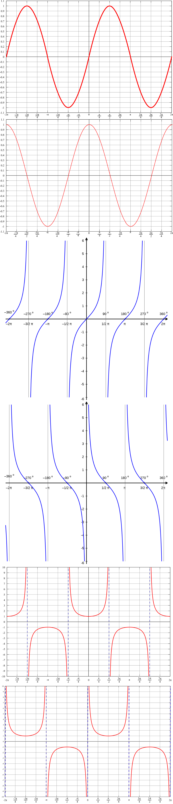
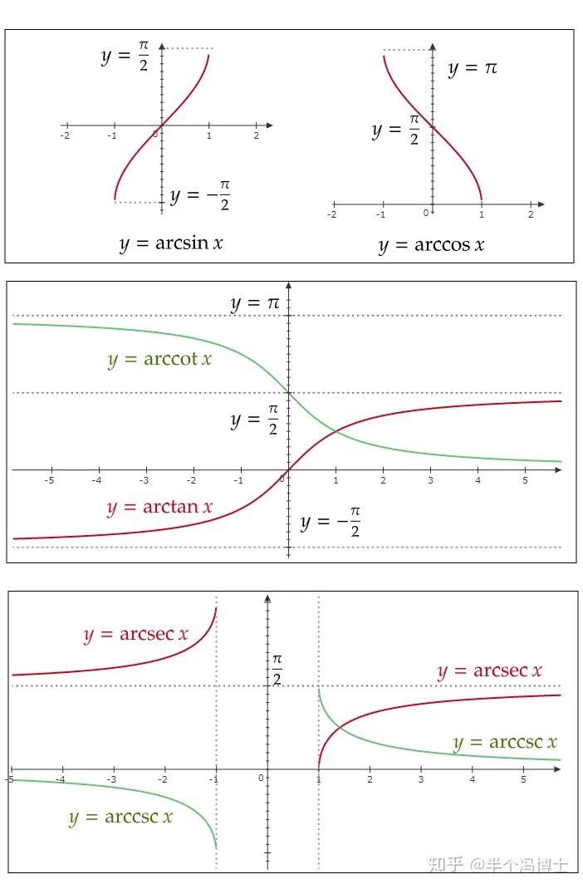

# 公式答案

## 导数

$(C){’} =$ $0$

$(X^{\mu}){’} = \mu{x}^{\mu-1}$ 

$(\sqrt{x}){’} =\frac{1}{2\sqrt{x}}$ 

$(\frac{1}{x}){’} = -\frac{1}{x^2}$ 

$(e^{x}){’} =e^{x}$ 

$(a^{x}){’} =a^{x}\ln{a}$ 

$(\ln{x}){’} =\frac{1}{x}$ 

$(\log_{a}{x}){’} =\frac{1}{x\ln{a}}$ 

$[\ln{(x+\sqrt{x^2+a^2})}]{’} =\frac{1}{\sqrt{a^2+x^2}}$ 

$(\sin{x}){’} =\cos{x}$ 

$(\tan{x}){’} =\sec^2{x}$ 

$(\sec{x}){’} =\sec{x}\tan{x}$ 

$(\cos{x}){’} =-\sin{x}$ 

$(\cot{x}){’} =-\csc^2{x}$ 

$(\csc{x}){’} =-csc{x}cot{x}$ 

$(\arcsin{x}){’} =\frac{1}{\sqrt{1-x^2}}$ 

$(\arccos{x}){’} =-\frac{1}{\sqrt{1-x^2}}$ 

$(\arctan{x}){’} =\frac{1}{1+x^2}$ 

$(\text{arccot}\ x){’} =-\frac{1}{1+x^2}$ 

## 三角函数

$y=\sin x$

$y=\cos x$

$y=\tan x$

$y=\cot x$

$y=\sec x$ 

$y=\csc x$

??? abstract "上述函数图像"

    

### 诱导公式

> 奇变偶不变，符号看象限。

$\sin(α+2kπ)=\sin α$ $\cos(α+2kπ)=\cos α$ $\tan(α+2kπ)=\tanα$ $\cot(α+2kπ)=\cotα$  

$\sin(-α)=-\sinα$ $\cos(-α)=cos α$ $\tan(-α)=-\tan α$ $\cot(-α)=-cot α$ 

$\sin(α+π)=-\sin α$ $\cos(α+π)=-\cos α$ $\tan(α+π)=\tan α$ $\cot(α+π)=cot α$ 

$\sin(π-α)=\sin α$ $\cos(π-α)=-\cos α$ $\tan(π-α)=-\tan α$ $\cot(π-α)=-\cot α$ 

$\sin(α+\frac{\pi}{2})=\cos α$ $\cos(α+\frac{\pi}{2})=-\sin α$ $\tan(α+\frac{\pi}{2})=-\cot α$ $\cot(α+\frac{\pi}{2})=-\tan α$ 

$\sin(\frac{\pi}{2}-α)=\cos α$ $\cos(\frac{\pi}{2}-α) =\sin α$ $\tan(\frac{\pi}{2}-α)=\cot α$ $\cot(\frac{\pi}{2}-α)=\tan α$ 

### 两角和与差

$\cos(\alpha + \beta) =\cosα\cosβ-\sinα\sinβ$

$\cos{(\alpha - \beta)} =\cos{\alpha}\cos{\beta}+\sin{\alpha}\sin{\beta}$

$\sin{(\alpha + \beta)} =\sin{\alpha}\cos{\beta}+cos{\alpha}\sin{\beta}$

$\sin{(\alpha - \beta)} = \sin{\alpha}\cos{\beta}-\cos{\alpha}\sin{\beta}$

$\tan{(\alpha + \beta)} = \frac{\tan{\alpha}+\tan{\beta}}{1-\tan{\alpha}\tan{\beta}}$

$\tan{(\alpha - \beta)} = \frac{\tan\alpha - \tan\beta}{1 + \tan\alpha\tan\beta}$

### 和差化积

$\sin\alpha + \sin\beta =  2\sin(\frac{\alpha + \beta}{2})\cos(\frac{\alpha - \beta}{2})$

$\sin\alpha - \sin\beta = 2\sin(\frac{\alpha - \beta}{2})\cos(\frac{\alpha + \beta}{2})$

$\cos\alpha + \cos\beta = 2\cos(\frac{\alpha + \beta}{2})\cos(\frac{\alpha - \beta}{2})$

$\cos\alpha - \cos\beta = -2\sin(\frac{\alpha + \beta}{2})\sin(\frac{\alpha - \beta}{2})$

### 积化和差

$\cos\alpha\sin\beta = \frac{1}{2}[\sin{(\alpha + \beta)} - \sin{(\alpha - \beta)}]$

$\sin\alpha\cos\beta = \frac{1}{2}[\sin{(\alpha + \beta)} + \sin{(\alpha - \beta)}]$

$\cos\alpha\cos\beta = \frac{1}{2}[\cos{(\alpha + \beta)} + \cos{(\alpha - \beta)}]$

$\sin\alpha\sin\beta = -\frac{1}{2}[\cos{(\alpha + \beta)} - \cos{(\alpha - \beta)}]$

### 二倍角公式

$\sin{2\alpha} = 2\sin\alpha\cos\alpha = \frac{2}{\tan\alpha + \cot\alpha}$

$\cos{2\alpha} = \cos^2{\alpha} - \sin^2{\alpha} = 2\cos^2{\alpha} - 1 = 1 - 2\sin^2{\alpha}$

$\tan{2\alpha} = \frac{2\tan\alpha}{1 - \tan^2{\alpha}}$

$\cot{2\alpha} = \frac{\cot^2{\alpha} - 1}{2\cot\alpha}$

$\sec{2\alpha} = \frac{\sec^2{\alpha}}{1 - \tan^2{\alpha}}$

$\csc{2\alpha} = \frac{1}{2\sin\alpha\cos\alpha} = \frac{1}{2}\sec\alpha\csc\alpha$

### 降幂公式

$\sin^2\alpha = \frac{1 - cos2\alpha}{2}$

$\cos^2\alpha = \frac{1 +\cos2\alpha}{2}$

$\tan^2\alpha = \frac{1 - \cos2\alpha}{1 + \cos2\alpha}$

### 辅助角公式

$a\sin\alpha + b\cos\alpha = \sqrt{a^2 +b^2}\sin(\alpha + \varphi)$

$其中\ \varphi\ 满足\ \cos\varphi = \frac{a}{\sqrt{a^2 + b^2}}，\sin\varphi = \frac{b}{\sqrt{a^2 + b^2}}$

### 万能公式

$\sin\alpha = \frac{2\tan\frac{a}{2}}{1 + \tan^2\frac{a}{2}}$

$\cos\alpha = \frac{1 - \tan^2\frac{a}{2}}{1 + \tan^2\frac{a}{2}}$

$\tan\alpha = \frac{2\tan\frac{a}{2}}{1-\tan^2\frac{a}{2}}$

## 反三角函数

$\arcsin{x}$

$\arccos{x}$ 

$\arctan{x}$

${\mathrm{arccot} {x}}$  

??? abstract "上述反三角函数的定义域、值域、图像："

       

## 积分公式

$\int{x^{\mu}dx} = \frac{1}{\mu + 1}x^{\mu+1} + C$

$\int{\frac{1}{\sqrt{x}}dx} = 2\sqrt{x} + C$

$\int{e^x dx} = e^x + C$

$\int{a^x dx} = \frac{a^x}{\ln{a}} + C$

$\int{\frac{1}{x}dx} = \ln|x| + C$

$\int{\sin{x}dx} = -\cos{x} + C$

$\int{\cos{x}dx} = \sin{x} + C$

$\int{\tan{x}dx} = \int{\frac{\sin{x}}{\cos{x}}dx} = -\int{\frac{d\cos{x}}{\cos{x}}} = -\ln|\cos{x}| + C$

$\int{\cot{x}dx} = \int{\frac{\cos{x}}{\sin{x}}dx} = \int{\frac{d\sin{x}}{\sin{x}}} = \ln|\sin{x}| + C$

$\int{\sec^2{x}dx} = \int{\frac{dx}{\cos^2x}} = \tan{x} + C$

$\int{\csc^2{x}dx} = \int{\frac{dx}{\sin^2x}} = -\cot{x} + C$

$\int{\frac{dx}{\sqrt{1-x^2}}} = \arcsin{x} + C$

$\int{\frac{dx}{1+x^2}} = \arctan{x} + C$

$\int{\sec{x}dx} = \ln|\sec{x} + \tan{x}| + C$

$\int{\csc{x}dx} = \ln|\csc{x} - \cot{x}| + C$

$\int{\frac{1}{\sqrt{a^2 - x^2}}dx} = \arcsin{\frac{x}{a}} + C$

$\int{\frac{1}{a^2 + x^2}dx} = \frac{1}{a}\arctan{\frac{x}{a}} + C$

$\int{\frac{1}{\sqrt{x^2 \pm a^2}}dx} = \ln|x + \sqrt{x^2 \pm a^2}| + C$

$\int{\frac{1}{1 + e^x}dx} = x - \ln(1 + e^x) + C$

$\int{\frac{1}{a^2 - x^2}dx} = \frac{1}{2a}\ln|{\frac{a+x}{a-x}}| + C$

$\int{\sqrt{x^2 + a^2}dx} = \frac{x}{2}\sqrt{x^2 + a^2} + \frac{a^2}{2}\ln{(x+\sqrt{x^2 + a^2}) + C}$

$\int{\sqrt{x^2 - a^2}dx} = \frac{x}{2}\sqrt{x^2 - a^2} - \frac{a^2}{2}\ln|{x+\sqrt{x^2 - a^2}| + C}$

$\int{\sqrt{a^2 - x^2}dx} = \frac{x}{2}\sqrt{a^2 - x^2} + \frac{a^2}{2}\arcsin{\frac{x}{a}} + C$

$\int{\sec^3{x}dx} = \frac{1}{2}(\sec{x}\tan{x}+\ln|\sec{x}+\tan{x}|)$

## 麦克劳林公式

$\sin x = x - \frac{1}{6}x^3 + o(x^3) = x - \frac{1}{3!}x^3 + \frac{1}{5!}x^5 + o(x^5) = \sum\limits_{n=0}^{\infty}(-1)^{n}\frac{x^{2n+1}}{(2n+1)!}$

$\arcsin x = x + \frac{1}{6}x^3 + o(x^3) = \sum\limits_{n=0}^{\infty}\frac{(2n-1)!!}{(2n)!!}\cdot\frac{x^{2n+1}}{2n+1}$

$\tan x = x + \frac{1}{3}x^3 + o(x^3) = \sum\limits_{n=1}^{\infty}\frac{(2^{2n}-1)2^{2n}B_n}{(2n)!}x^{2n-1}，\{B_n\}为伯努利数，即B_1=\frac{1}{6},B_2=\frac{1}{30},\cdot\cdot\cdot$

$\arctan x = x - \frac{1}{3}x^3 + o(x^3)$

$\cos x = 1 - \frac{1}{2}x^2 + \frac{1}{24}x^4 + o(x^4) + ...+(-1)^{n}\frac{x^{2n}}{（2n）!}= \sum\limits_{n=0}^{\infty}(-1)^{n}\frac{x^{2n}}{(2n)!}$

$\ln(1+x) = x - \frac{1}{2}x^2 + \frac{1}{3}x^3 + o(x^3) = \sum\limits_{n=1}^{\infty}(-1)^{n-1}\frac{x^n}{n}$

$a^x = 1+ x\ln{a} + \frac{1}{2}{(x\ln{a})}^2 + \frac{1}{6}{(x\ln{a})}^3 + o(x^3) = \sum\limits_{n=0}^{\infty}\frac{{(x\ln{a})}^n}{n!}$

$e^x = 1+ x + \frac{1}{2}x^2 + \frac{1}{6}x^3 + o(x^3) = \sum\limits_{n=0}^{\infty}\frac{x^n}{n!}$

$(1+x)^a = 1 + ax + \frac{a(a-1)}{2}x^2 + o(x^2) =1 + \sum\limits_{n=1}^{\infty}\frac{a(a-1)\cdot\cdot\cdot(a-n+1)}{n!}x^n$

$\frac{1}{1+x} = 1 - x + x^2 - x^3 + o(x^3) = \sum\limits_{n=0}^{\infty}{(-1)^n}{x^n}$

$\frac{1}{1-x} = 1 + x + x^2 + x^3 + o(x^3) = \sum\limits_{n=0}^{\infty}x^n$

$\sqrt{1+x} = 1 + \frac{1}{2}x - \frac{1}{2 \cdot 4}x^2 + \frac{1 \cdot 3}{2 \cdot 4 \cdot 6}x^3 - \frac{1 \cdot 3 \cdot 5}{2 \cdot 4 \cdot 6 \cdot 8}x^4 + o(x^4)$

$\frac{1}{\sqrt {1+x}} = 1 - \frac{1}{2}x + \frac{1}{2 \cdot 4}x^2 - \frac{1 \cdot 3}{2 \cdot 4 \cdot 6}x^3 + \frac{1 \cdot 3 \cdot 5}{2 \cdot 4 \cdot 6 \cdot 8}x^4 + o(x^4)$

### 重要差函数

$x - \sin{x} \sim \frac{1}{6}x^3$

$\arcsin{x} - x \sim \frac{1}{6}x^3$

$1 - \cos{x} \sim \frac{1}{2}x^2$

$x - \ln{(1+x)} \sim \frac{1}{2}x^2$

$\tan{x} - x \sim \frac{1}{3}x^3$

$e^x - 1 \sim x$

$e^x - 1 - x \sim \frac{1}{2}x^2$

$\tan{x} - \sin{x} \sim \frac{1}{2}x^3$

推广：$\tan{f(x)} - \sin{f(x)} \sim \frac{1}{2}f^3(x)$

$\arctan{x} - \arcsin{x} \sim -\frac{1}{2}x^3$

> 注意：$f(x) \pm g(x) = cx^k + o(x^k)$ ，而 $f(x) \pm g(x) \sim cx^k$ 。

## 高阶导数

$[\sin(ax+b)]^{(n)}={a^n}sin(ax+b+\frac{n\pi}{2})$

$[\cos(ax+b)]^{(n)}={a^n}cos(ax+b+\frac{n\pi}{2})$

$[\ln(ax+b)]^{(n)}=(-1)^{n-1}a^{n}\frac{(n-1)!}{(ax+b)^n}$

$(\frac{1}{ax+b})^{(n)}=(-1)^n a^n \frac{n!}{(ax+b)^{n+1}}$

$(e^{ax+b})^{(n)}= a^n e^{ax+b}$

